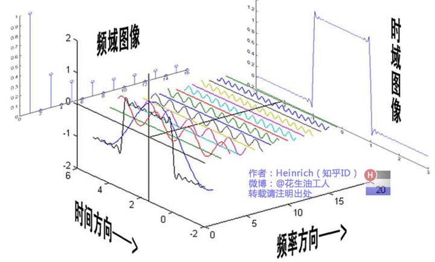
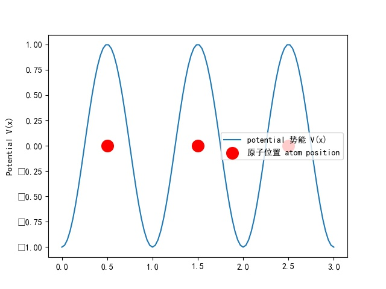

* TOC
{:toc}


# DFT Theory 密度泛函计算基本理论
 latex test docs index


## basic concepts 基本概念：如何计算
摘自David S. Sholl, _Density functional Theory_

### Hohenberg-Kohn 1st Theorem :

The ground-state energy from Schroginger's equation is a unique functional of the electron density.

OR

ground state electron density uniquely determines all properties: energy/ wavefunction.

基态能量是电子密度分布函数(或者说，基态电子在空间中的密度分布)的泛函
一个基态电子密度对应了唯一的能量、波函数。

问题：泛函形式未知

### Hohenberg-Kohn 2nd Theorem :

The electron density that minimizes the energy of the overall functional is the true electron density corresponding to the full solution of the schrodinger equation.

使这个泛函结果（能量）最低的电子密度是薛定谔方程的解

->如果知道了泛函的形式，那么就可以计算出基态电子密度

### n(r), 或者基态电子密度

基态电子密度　$$n_{(r)} = 2\Sigma \phi_i^*(r)\phi_i(r)$$

更清楚一点

$$n_{(x,y,z)} = 2\phi_1^*(x,y,z)\phi_1(x,y,z)+2\phi_2^*(x,y,z)\phi_2(x,y,z)+2\phi_3^*(x,y,z)\phi_3(x,y,z)+.....$$

缩成一维：

$$n_{(x)} = 2\phi_1^*(x)\phi_1(x)+2\phi_2^*(x)\phi_2(x)+2\phi_3^*(x)\phi_3(x)+.....$$，对所有电子

是个期望值一样的东西

### 泛函的具体形式 the energy functional=？

对于单个电子已知如下：

$$E[\phi_i(r)]=E_{known}[\phi_i(r)]+E_{unknown}[\phi_i(r)]$$

方括号是泛函的意思。泛函类似于函数，函数是输入未知数得到一个结果，或者说数到数的对应。而泛函是输入一个函数得到一个数，或者说函数到数的映射。比如说，一个泛函的形式是从0到1积分，那么输入f(x)=x+1这个函数，得到的是数字1.5。泛函跟函数的表达方式类似，但是把圆括号变成方括号
$$ n(r) -- E[] --> E[n(r)] $$


$$E_{known}[]$$是已知的能量泛函，包括电子动能，电子-核与电子-电子

$$E_{unknown}[]$$是未知的能量泛函：交换能


其中

$$E_{known}[\phi_i(r)]=\frac{-\hbar}{m}\Sigma\int\phi_i^*(r)\nabla^2\phi_i(r)d^3r+\int V(r)n(r)d^3r+e^2/2\int \int \frac {n(r)n(r')}{|r-r'|}d^3rd^3r'+E_{ion}$$

缩成一维，对于0号电子$$\phi_0$$

$$E_{known}[\phi_0(x)]=\frac{-\hbar}{m}\Sigma\int\phi_0^*(x)\phi_0''(x)dx+\int V(x)n(x)dx+e^2/2\int \int \frac {n(x)n(x')}{|x-x'|}dxdx'+E_{ion}$$

（不太清楚为什么会有一个求和）

由于前述$$n_{(r)} = 2\Sigma \phi_i^*(r)\phi_i(r)$$

所以虽然不知道是否合理，但是推导出来这个公式，即phi（波函数）和n（r）（电子密度）有同样的泛函

$$E[2\Sigma \phi_i^*(r)\phi_i(r)]=E_{known}[2\Sigma \phi_i^*(r)\phi_i(r)]+E_{unknown}[2\Sigma \phi_i^*(r)\phi_i(r)]$$

也就是说电子密度的泛函的形式与波函数相同，是： 
$$E[]=E_{known}[]+E_{unknown}[]$$

问题：解不出来电子密度n(r)因此需要kohn sham 方程解n(r)

### Kohn-Sham equation

Kohn-Sham equation是用来找电子密度，即n(r):

Kohn-Sham 方程是:

$$[\frac{-\hbar^2}{2m}\nabla^2+V(r)+V_H(r)+V_{XC}(r)]\phi_i(r)=\epsilon_i\phi_i(r)$$

其中

$$V(r)$$是薛定谔方程中已知的，是电子和所有原子核的相互作用

$$V_H(r)$$是hartree potential，是 coulomb repulsion  between "this electron" and "the total electron density", 或者说电子i和整个电子密度n(r)之间的coulomb repulsion

$$V_H(r)=e^2\int \frac{n(r')}{|r-r'|}d^3r'$$
理解为以r点的坐标向外积分？

$$V_{XC}$$是未知的，虽然有
$$V_{XC}=\frac{\delta E_{XC}(r)}{\delta n(r)}$$

用人能看懂的方法重新写

对于0号电子,其具有能量$$\epsilon_0$$，缩到一维，波函数满足

$$[\frac{-\hbar^2}{2m}\phi_0''(x)+V(x)+e^2\int \frac{n(x')}{|x-x'|}dx'+V_{XC}(x)]\phi_0(x)=\epsilon_0\phi_0(x)$$

### 递归求解

如果不考虑Vxc这个未知项目（直接删掉这个项），那么其余部分是可以通过递归来进行精确求解的：
1\猜测一个 初始电子密度

guess a initial trial electron density n(r)

2\ 解kohn sham 方程，得到每一个电子的波函数

solve the kohn-sham equation with n(r), get the $$\phi(r)$$

3\ 计算新的电子密度

通过$$n_{(r)} = 2\Sigma \phi_i^*(r)\phi_i(r)$$

4\ 调整电子密度递归运算

### 结论：

通过 Hohenberg-Kohn定理和Kohn-Sham方程，距离比较精确地求解薛定谔方程目前只差一个合适的$$E_{XC}$$泛函

## 寻找合适的$$E_{XC}$$泛函

### LDA近似：计算Exc的一种方式

如前文所讲Exc泛函是很难知道形式的。

Exc只在一种情况下可以知道形式:当n(r)=常数，即uniform electron gas

$$V_{XC}(r)=V^{electron gas}_{XC}[n(r)]$$

*防止混淆,左边是函数$$V_{XC}()$$，右边是泛函$$V^{electron gas}_{XC}[]$$

使用LDA近似后，可以精确地解薛定谔方程，但是这个解不是真实解，因为薛定谔方程中的Exc是假的

### GGA

Use local electron density and the local gradient in the electron density calculation

GGA泛函是局部电子密度，和局部电子密度的梯度的函数

$$V_{XC}^{GGA}(r)=V_{XC}[n(r),\nabla n(r)]$$

一维下：

$$V_{XC}^{GGA}(x)=V_{XC}[n(x),\frac{dn(x)}{dx}]$$

主流有：PW91 和 PBE
由于包括了电子密度一阶导项，所以一般认为GGA会比LDA更加准确，但是也有例外，比如在计算过渡金属的表面能的时候

### meta-GGA

在GGA基础上，还会包含二阶导的信息。实际操作上，二阶导是使用了kinetic energy density of the Kohn Sham orbital:


$$\tau(r)=0.5\sum_{occupied states}|\nabla\phi(r)|^2$$

泛函形式是：
$$V_{XC}^{meta-GGA}[n(r),\nabla n(r),\tau(r)]$$

### hyper-GGA

看不太懂啥意思，形式更加复杂，包含了部分真实Exc项，但是只有在计算小分子时候效果好，在计算bulk material时候不太行的


## 寻找合适的波函数-hartree fock

泛函在前文已经基本找好了，这里介绍找波函数的过程

当不考虑Exc时候，可以对KohnSham方程进行比较好的计算：

### 单个电子与多电子的波函数

对于单个电子，其波函数是localized的，可以用类似于$$y=e^{-x^2}$$描述，没有周期性，且在远离x=0的地方y约为0。但是对于晶体等多电子体系，应该使用周期性的波函数，比如$$y=sin^2(x)$$

### Hartree product
当总共只有一个电子时候，

$$h\Chi=E\Chi$$

会得到许多个解 $$\Chi_j$$
对于每个解$$\Chi_1,\Chi_2,\Chi_3,....$$
(假设$$\Chi_1$$对应了最低能量)
对应的能量分别是 $$E_1,E_2,E_3,....$$,

其中$$E_1$$是能量最低的基态

对于多个电子体系来说

当忽略了电子-电子相互作用时

Hamiltonian： $$H=h_1+h_2+h_3+...$$

$$h_i$$是第i个电子的动能和势能算符

可以得到
$$\phi(x_1,x_2,....x_n)=\prod{\Chi_{ji}}$$
其中j代表了能级（像上面j=1是基态）

对于基态来讲
$$\phi(x_1,x_2,....x_n)=\Chi_{11}(x_1)\Chi_{12}(x_2)\Chi_{13}(x_3)...$$

能量则是简单相加
$$E=E_{11},E_{12},E_{13},....$$,

以上方法求得的波函数由于忽略了电子-电子相互作用，所以存在以下问题：

_由于电子是费米子，所以当两个电子交换位置时候符号必须改变_

然而，当电子交换位置时候，按照上式，波函数的正负号没有变化

所以：引入Slater determinant

双电子的Slater determinant:

$$\phi(x_1,x_2)=\frac{1}{\sqrt2}det\left\{\begin{matrix}
\Chi_j(x_1)&\Chi_j(x_2)\\
\Chi_k(x_1)&\Chi_k(x_2)\\
\end{matrix}\right\}$$

$$\phi(x_1,x_2)=\frac{1}{\sqrt2}[\Chi_j(x_1)\Chi_k(x_2)-\Chi_k(x_1)\Chi_j(x_2)]$$

这个波函数满足pauli exclusiong principle：不区分电子， 当电子具有相同坐标时等于0

### hartree fock calculation 

hartree fock calculation 基于这个假设；原子核位置固定


Kohn sham 方程是
$$[\frac{-\hbar^2}{2m}\nabla^2+V(r)+V_H(r)+V_{XC}(r)]\phi_i(r)=\epsilon_i\phi_i(r)$$

而对于**单个**电子,HF calculation是： 
$$[\frac{-\hbar^2}{2m}\nabla^2+V(r)+V_H(r)]\phi_i(x)=E_j\Chi_j(x)$$
相比于kohn sham减少了一个Exc项

由前面slater行列式可以看到，如果想要描述一个N个电子体系，那么需要知道$$\Chi_1$$到$$\Chi_N$$

对此，可以找到有限个（K个）函数，即$$\phi_{1}(x)$$到$$\phi_{K}(x)$$，使得这K个函数可以加权相加得到$$\Chi_1$$到$$\Chi_N$$
这K个函数被称为basis set
即：

$$\Chi_j(x)=\sum^K_{i=1}\alpha_{j,i}\phi_{i}(x)$$

写的清楚一点，对第一个$$\Chi_1(x)$$：

$$\Chi_1(x)=\alpha_{1,1}\phi_{1}(x)+\alpha_{1,2}\phi_{2}(x)+...+\alpha_{1,K}\phi_{K}(x)$$

现在已知$$\phi_{1}(x)$$到$$\phi_{K}(x)$$，问题变成了找到$$\alpha_{j,i}$$

找到$$\alpha_{i,j}$$的方式：继续进行递归运算：

1, 猜测一组初始的$$\alpha_{j,i}$$

2，通过这个初始的$$\alpha_{j,i}$$计算出来一组n(r)

3, n(r)代回$$\Chi_j(x)=\sum^K_{i=1}\alpha_{j,i}\phi_{i}(x)$$方程，求解$$\alpha_{j,i}$$

通过这个递归运算，可以得到一个精确的能量值，这个能量值是Hartree fock limit.

这个值虽然精确，但并不是实际的电子能量， 因为没有考虑到Exc，即Hartree fock方法实际上并没有解决电子-电子相互作用

### DFT计算过程总结

结合上文Kohn sham 方程计算，完整的DFT计算过程如下：

1, 猜测一组初始的$$\alpha_{j,i}$$

2，通过这个初始的$$\alpha_{j,i}$$计算出来一组n(r)

3，通过这个n(r) 解kohn sham方程 （或者不含Exc的Kohn sham方程，这个时候计算的是hartree fock limitx），得到每一个电子的波函数

4, 用每一个电子波函数计算n(r)

（通过$$n_{(r)} = 2\Sigma \phi_i^*(r)\phi_i(r)$$）

5，将n(r)代回$$\Chi_j(x)=\sum^K_{i=1}\alpha_{j,i}\phi_{i}(x)$$方程，求解$$\alpha_{j,i}$$

6，得到的$$\alpha_{j,i}$$代回第二步

### Exc

Electron correlation energy = True system energy - Hartree fock limit.

即Exc就是实际的能量减去Hartree fock limit


## 一些补充
参考书：Richard M. Martin _Electronic structure: Basic theory and practical method_

## 物质的性质： property of matters

物质属性一般会取决于两个种类：
1、electronic ground state 基态电子
2、electronic excited state 激发态电子

原因是；原子核质量远大于电子，因此相对于电子来说可以基本看作静止
这就是Born-Oppenheimer approximation

电子最低能量态决定了原子核的结构
the lowest energy state of the elctrons determines the spatial structure of nuclei:

### bonding：
一般认为分为5类：
closed shell system:稀有气体
ionic
metallic
covalent
hydrogen:比较特殊，因为氢原子是唯一没有core electron的 （往上面的氦的core electron是1s的两个电子）

实际材料的bonding一般是这五种的结合

### Hartree atomic units

$$\hbar =m_e = e = 4\pi /\epsilon_0 = 1$$

定义以上单位为1，用来简化计算

# 晶体学知识 crystallography

参考书：Richard M. Martin _Electronic structure: Basic theory and practical method_

A crystal can be completely specified by the types and positions of the nuclei in **one repeat unit (primitive unit cell)** annd the rules that describe the **repetition (translation)**

primitive cell有很多种，wigner seitz cell是其中一种

Wigner Seitz cell: the most compact cell that is symmetric about the origin **注意 wigner seitz cell是在real space/实空间** 

wigner seitz cell在倒空间对应的是**first brillouin zone**

_fcc 的 wigner seitz cell是bcc的first brillouin zone_


## fourier transformation


转载自 wikipedia

转载自_https://zhuanlan.zhihu.com/p/19763358_，这个讲的很清楚


## reciprocal sapce 倒易空间

考虑任何一个描述晶体性质的方程（比如说电子密度）

由于晶体的周期性，在实空间电子密度是周期性相同的,也就是说对于电子密度$$n(r+T(r'))=n(r)$$其中T是任何的translation操作

### 一维理解

对于一个一维的，总共三个晶格的晶体，晶格常数为a

---《原子》---a---《原子》---a---《原子》---



那么电子密度n(x)必须满足：

    n(x)    =    n(x+a)       =n(x+2a)  
         
当0<x<a

因为n(x)有这样的周期性，所以一定可以对其进行傅里叶变化

傅里叶变化是从x空间变为q空间$$n(x)->n(q)$$

对于这个长度为3的一维晶体，其中含有3个cell，那么晶格个数N=3

从x空间到q空间的傅里叶变化是

$$n(q)=\frac{1}{\Omega_{crystal}}\int_{\Omega_{crystal}} dxn(x)exp(iq·x)$$

代入条件

$$n(q)=\frac{1}{3a}\int_0^{3a} dxn(x)e^{(iq·x)}$$

对于每一个晶格内部进行积分

$$n(q)=\frac{1}{3a}(\int_0^adxn(x)e^{iq·x} +\int_a^{2a}dxn(x)e^{iq·x}+\int_{2a}^{3a}dxn(x)e^{iq·x})$$

$$n(q)=\frac{1}{3a}(\int_0^adxn(x)e^{iq·x} +\int_0^{a}dxn(x+a)e^{iq·(x+a)}+\int_{0}^{a}dxn(x+2a)e^{iq·x+2a})$$

由于n(x)周期性n(x)=n(x+a)=n(x+2a)

$$n(q)=\frac{1}{3a}(\int_0^adxn(x)e^{iq·x} +\int_0^{a}dxn(x)e^{iq·(x+a)}+\int_{0}^{a}dxn(x)e^{iq·x+2a})$$

把exp拆开

$$n(q)=\frac{1}{3a}(\int_0^adxn(x)e^{iq·x} +\int_0^{a}dxn(x)e^{iq·x}e^{iq·a}+\int_{0}^{a}dxn(x)e^{iq·x}e^{iq·2a})$$

合并得到

$$n(q)=\frac{1}{3a}(e^{iq·0a}+e^{iq·a}+e^{iq·2a})(\int_0^adxn(x)e^{iq·x})$$

从而得到三维大晶体的一般形式：

$$f(q)=\frac{1}{\Omega_{crystal}}\sum_0^{N_xa1}\sum_0^{N_ya2} \sum_0^{N_za3}  e^{iq·T(n1,n2,n3)} \int_0^{a1} \int_0^{a2} \int_0^{a3} dxdydzf(x,y,z) e^{iq·(x,y,z)}$$

$$f(q)=\frac{1}{\Omega_{crystal}}\sum e^{iq·T} \int drf(r) e^{iq·r}$$

T是所有可能的平移（translation）操作

### 倒空间的有意义的点q需要满足的条件

根据Born-Von Karmen条件，傅里叶变化后的每一个component都必须满足 $$exp(i q·Na)=1$$

为了满足$$exp(iq·3a) =1$$，则必须有：

$$q·a=2\pi \frac{integer}{3}$$

对于三维大晶体，$$q·a=2\pi \frac{integer}{N}$$

N是一个很大的值，所以大晶体的q点是连续的

### 一维小晶体的倒空间与布里渊区

继续对于$$q·a=2\pi \frac{integer}{3}$$

尝试当interger=1

$$q·a=\frac{2\pi}{3}$$

$$q=\frac{2\pi}{3a}$$

$$n(q)=\frac{1}{3a}(e^{0}+e^{\frac{i2\pi}{3}}+e^{\frac{i4\pi}{3}})(\int_0^adxn(x)e^{iq·x})$$

然而

$$e^{0}+e^{\frac{i2\pi}{3}}+e^{\frac{i4\pi}{3}}=0$$

所以$$n(\frac{2\pi}{3a})=0$$

之后发现只有当$$q·a=2\pi · integer$$时（而非$$q·a=2\pi \frac{integer}{3}$$）

n(q)才有

$$n(q)=\frac{1}{3a}(e^{2\pi}+e^{2\pi}+e^{2\pi})(\int_0^adxn(x)e^{2\pi})$$

$$n(q)=\frac{1}{3a}(1+1+1)(\int_0^adxn(x)*1)$$

也就是说，是个非0的fourier component

从而定义单位倒易矢量$$b=\frac{2\pi}{a}$$


使n(r)的fourier component 非0的q的集
合记为G（倒易空间），

$$G(m)=m * b$$

其中m为任意正整数，且m=0 为基态

第一布里渊区是倒空间的wigner-seitz cell

同样用上面的3a大小的一维晶体距离

注意倒空间是无限长的一维空间,倒空间两个相邻格点之间距离为$$b=\frac{2\pi}{a}$$

第一布里渊区是

$$-\frac{\pi}{a}<q<+\frac{\pi}{a}$$

q=0对应了基态

**注意：这些是基态的条件**

### 三维大晶体的倒空间与布里渊区


$$n(x+x',y+y',z+z')=n(x,y,z)$$，其中x' y' z'是整数倍的$$a_1 a_2 a_3$$

$$a_1 a_2 a_3$$是三个晶格向量

傅里叶变化可以对所有有周期性性质的函数使用

因为n(r)有这样的周期性，所以一定可以对其进行傅里叶变化

傅里叶变化是$$n(r)->n(q)$$

对于一个体积为$$\Omega$$的三维晶体，其中含有$$N_x \times N_y \times N_z = N_{cell}$$个cell的体系 

根据Born-Von Karmen条件，傅里叶变化后的每一个component都要满足 $$exp(iq· N_x a_1)=exp(iq· N_ya_2)=exp(iq· N_z a_3)=1$$

为了满足$$exp(iq· N_x a_1)=exp(iq· N_ya_2)=exp(iq· N_z a_3)=1$$，则必须有：

$$q·(a_1,a_2,a_3)=2\pi \frac{integer}{N_i}$$

从r到q的傅里叶变化是

$$f(q)=\frac{1}{N_{cell}\Omega_{cell}}\sum e^{iq·T} \int drf(r) e^{iq·r}$$

通过计算，使f(q)非零需要满足的条件是

$$q·(a_1,a_2,a_3)=2\pi · integer$$

从而确立了倒空间的基矢，
$$G(m_1,m_2,m_3)=m_1b_1,m_2b_2,m_3b_3$$

其中$$m_1,m_2,m_3$$是任意整数，$$b_1,b_2,b_3$$是$$a_1 a_2 a_3$$的倒向量

## bloch theorem的推导

### bloch theorem第一种证明

根据一通看不懂的证明（P87~P88, section 4.4 Richard M. Martin _Electronic structure: Basic theory and practical method_）

继续考虑一维情况，对于一个算符，比如说$$\hat{H}$$作用在电子波函数上，得到电子能量。$$\hat{H}$$是算符，$$\epsilon$$是本征态$$\phi(x)$$是本征方程
$$\hat{H}\phi(x)=[-\frac{\hbar^2}{2m_e }\nabla^2+V(r)]\phi(x)=\epsilon\phi(x)$$

类似得，可以定义translation算符$$\hat{T_x}$$,角标x代表一维的x轴上的translation

$$\hat{T}_{x_0}\phi(x)=\phi(x+x_0)$$

不知道为什么但是hamiltonian $$\hat{H}$$与$$\hat{T_x}$$是commute的

$$\hat{H}\hat{T_x}=\hat{T_x}\hat{H}$$

由于commute，$$\hat{H}$$的本征态也是$$\hat{T_x}$$的本征态

另外由于$$\hat{T}_{x_0}\hat{T}_{x_1}=\hat{T}_{x_0+x_1}$$

(显然分别挪了x0和x1的操作与一下子挪了x0+x1的操作结果是一样的)

则一定有$$\hat{T}_{x_0+x_1}\phi(x)=\hat{T}_{x_0}\hat{T}_{x_1}\phi(x)=t_{(x_0+x_1)}\phi(x)=(t_{x_0}+t_{x_1})\phi(x)$$

由于如下看不懂的原因：
**modules of t(x) must be unity 模必须为1？？**

**且本征方程必须满足周期性**

所以**t(x)必须有$$t(x)=e^{ik·T_x}$$格式**

其中$$T_x$$是x轴上移动的距离，$$k=\frac{integer\times b}{cell总数}=\frac{2n\pi}{3a}$$.其中n是任意整数integer，b是倒易空间单位矢量

由此有bloch theorem：

**$$\hat{T}_x\phi(x)=\phi(x+t_x)=e^{ik·T_x}\phi(x)$$**


### bloch theorem的第二种证明

继续在之前的晶格常数为a总长度为3的一维晶体例子 

由于势能一定具有晶格的周期性，晶格的周期性是整数倍的晶格常数，根据前面的Born-Von Karmen条件，一定可以将V(x)进行从x空间变换到k空间的傅里叶变换，变成成如下形式

$$V(x)=\sum _K v_K e^{iKx}$$其中$$v_K$$是系数,K是所有的倒易空间矢量（整数倍的$$\frac{2\pi}{a}$$）

这个变换是正确的，因为V(x)保留了周期性且周期性为a（晶格常数），有如下证明$$V(x+a)=\sum _K v_K e^{iK(x+a)}=\sum _K v_K e^{i\frac{2n\pi}{a}(x+a)}=\sum _K v_K e^{i\frac{2n\pi}{a}x}e^{i\frac{2n\pi}{a}a}=\sum _K v_K e^{i\frac{2n\pi}{a}x}*1=V(x)$$

傅里叶变换中的系数$$v_K=\frac 1v \int_{cell} dxe^{-iKx}V(x)$$
在此一维晶体$$v_K=\frac{1}{a} \int_{0}^{a} dxe^{-iKx}V(x)$$

取决于参照对象，势能是可以整体上升或者下降的（考虑同一高度对于1、地面和2、珠穆朗玛峰 的重力势能），为了计算方便要求$$v_0=0$$

也就是说$$v_0=\frac{1}{a} \int_{0}^{a} dxe^{-i*0*x}V(x)=\frac{1}{a} \int_{0}^{a} V(x)dx$$

由于V(x)是实数方程，要求有$$v_K=v_{-K}=v_K*$$

由于电子在接近原子核处势能高，离开原子核处势能低，而且势能是周期性的

非常粗浅地假设势能是cos形式 $$V(x)=-cos\frac{2\pi x}{a}$$


此时可以得到V(x)有精确的傅里叶展开是（对于其他一般的V(x)难以得到精确展开，只是举个例子）

$$V(x)=-cos\frac{2\pi x}{a}=-(0.5cos\frac{2\pi x}{a}+0.5isin\frac{2\pi x}{a})-(0.5cos\frac{2\pi x}{a}-0.5isin\frac{2\pi x}{a})=-0.5e^{\frac{i2\pi}{a}x}-0.5e^{\frac{-i2\pi}{a}x}$$

也就是说当$$K=2\pi/a以及K=-2\pi/a$$ 时$$v_k=-0.5$$，对其他K值$$v_k=0$$

根据前面的Born-Von Karmen条件，也可以将单电子波函数（本征方程）进行类似的变换。注意波函数本身未必具有周期性，所以只是普通的傅里叶展开.$$c_q$$是每个展开的系数

$$\phi(x)=\sum _q c_qe^{iqx}$$

将以上代入薛定谔方程得到

有$$\hat{H}\sum_q c_qe^{iqx}=[-\hbar^2 \nabla^2 /2m + (-0.5e^{\frac{i2\pi}{a}x}-0.5e^{\frac{-i2\pi}{a}x})]\sum_q c_qe^{iqx}$$

$$=\frac{\hbar^2}{2m} \sum _q q^2c_qe^{iqx}+ \sum_q -0.5c_qe^{i(q+\frac{2\pi}{a})x} + \sum_q -0.5c_qe^{i(q+\frac{-2\pi}{a})x}=\epsilon \sum _q c_qe^{iqx}$$

由于一个不知道的原因（需要后面再进行理解，或许是因为傅里叶展开的q是从负无穷到正无穷所以无所谓？）
$$\sum_q -0.5c_qe^{i(q+\frac{2\pi}{a})x} =\sum_{q'}-0.5c_{q'-\frac{2\pi}{a}}e^{iq'r}=\sum_q-0.5c_{q-\frac{2\pi}{a}}e^{iqr}$$
$$\sum_q -0.5c_qe^{i(q+\frac{-2\pi}{a})x} =\sum_{q'}-0.5c_{q'-\frac{-2\pi}{a}}e^{iq'r}=\sum_q-0.5c_{q-\frac{-2\pi}{a}}e^{iqr}$$

代入上式

$$\frac{\hbar^2}{2m} \sum _q q^2c_qe^{iqx}+ \sum_q -0.5c_qe^{i(q+\frac{2\pi}{a})x} + \sum_q -0.5c_qe^{i(q+\frac{-2\pi}{a})x}=\epsilon \sum _q c_qe^{iqx}$$
$$\frac{\hbar^2}{2m} \sum _q q^2c_qe^{iqx}+ \sum_q-0.5c_{q-\frac{2\pi}{a}}e^{iqr} + \sum_q-0.5c_{q-\frac{-2\pi}{a}}e^{iqr}=\epsilon \sum _q c_qe^{iqx}$$
$$\sum _q e^{iqx}[(\frac{\hbar^2}{2m}q^2-\epsilon)c_q+(-0.5c_{q-\frac{2\pi}{a}})+(-0.5c_{q-\frac{-2\pi}{a}})]=0$$

最后得到了动量空间的薛定谔方程，形式如下
$$(\frac{\hbar^2}{2m}q^2-\epsilon)c_q+(-0.5c_{q-\frac{2\pi}{a}})+(-0.5c_{q-\frac{-2\pi}{a}})=0$$

对于任意的V(x),薛定谔方程的一般形式为
**$$(\frac{\hbar^2}{2m}q^2-\epsilon)c_q+\sum_{K'}v_{K'}c_{q-K}=0$$**


$$c_q$$是单电子波函数傅里叶变换的展开项系数，是未知量，q在这里是自变量，是倒易空间中的倒易矢量（任意分数/整数倍的$$\frac{2\pi}{a}$$）。对于每一个倒易矢量q，这个动量空间薛定谔方程都（大概）是可解的，得到了每个q对应的$$c_q$$值，从而获得单电子波函数在空间的比较严格的表达形式$$\Phi(x)=\sum _q c_qe^{iqx}$$。此式也被称为wannier functions

显然倒空间的q有无限多个，计算上面是不可能实现的。所以只取一部分的q点进行计算。vasp的k point就是用来定义取的q点，也就是说，如果把q取值范围限定成这样的一系列点的集合：$$q_k \in [k+K,k是第一布里渊区中的一个有效点,K是整数倍的 \frac{2\pi}{a}]$$，比如说$$q_\frac{2\pi}{3a} \in  [\frac{2\pi}{3a}, \frac{2\pi}{a}+\frac{2\pi}{3a},\frac{4\pi}{a}+\frac{2\pi}{3a},\frac{6\pi}{a}+\frac{2\pi}{3a},.......]$$

把这个限制条件代入$$\phi(x)=\sum _q c_qe^{iqx}$$

可以得到限定条件中规定的点k所对应的单电子波函数，即

$$\phi(x,k)=\sum _{q_k} c_{q_k}e^{iq_kx}$$

将$$q_k$$限定条件代入可以写作如下格式

$$\phi(x,k)=\sum _K c_{k+K\times \frac{2\pi}{a}} e^{i(k+K)x}$$

例如

$$\phi(x,\frac{2\pi}{3a})=c_{\frac{2\pi}{3a}} e^{i(\frac{2\pi}{3a})x}+c_{\frac{2\pi}{3a}+\frac{2\pi}{a}} e^{i(\frac{2\pi}{3a}+\frac{2\pi}{a})x}+c_{\frac{2\pi}{3a}+\frac{4\pi}{a}} e^{i(\frac{2\pi}{3a}+\frac{4\pi}{a})x}+....$$

提取公因数

$$\phi(x,\frac{2\pi}{3a})=c_{\frac{2\pi}{3a}} e^{i(\frac{2\pi}{3a})x}+c_{\frac{2\pi}{3a}+\frac{2\pi}{a}} e^{i(\frac{2\pi}{3a})x}e^{\frac{2\pi}{a}x}+c_{\frac{2\pi}{3a}+\frac{4\pi}{a}} e^{i(\frac{2\pi}{3a})x}e^{\frac{4\pi}{a}x}+....$$

整理得到

$$\phi(x,\frac{2\pi}{3a})=e^{i(\frac{2\pi}{3a})x}[c_{\frac{2\pi}{3a}} e^{i*0*x}+c_{\frac{2\pi}{3a}+\frac{2\pi}{a}}e^{\frac{2\pi}{a}x}+c_{\frac{2\pi}{3a}+\frac{4\pi}{a}}e^{\frac{4\pi}{a}x}+....]$$

也就是说

$$\phi(x,k)=e^{ikx}\sum _K c_{k+K} e^{iKx}$$

令$$u(x,k)=\sum _K c_{k+K} e^{iKx}$$

可以看到$$u(x,k)$$是一种傅里叶展开的形式，而且$$e^{iKx}$$项说明u(x,k)在x轴上具有周期性，且周期性为晶格常数a，与势能的周期性相同

这样得到了bloch theorem第二种说法是：
**对于单电子的hamiltonian $$\hat{H}=[-\hbar^2 \nabla^2 /2m + V(r)]$$,若其中V（r）为势能项且具有布拉维晶格的周期性，则这个Hamiltonian的本征方程一定可以被如下的形式写出：**

**$$\phi(x,k)=e^{ikx}u(x,k)$$**

**需要注意：本征方程可以如此写出，但是这个本征方程并不一定代表单电子波函数的方程，这个方程仅代表单电子在点k所对应的波函数。而完整单电子波函数方程是wannier function：$$\Phi(x)=\sum _{brillouin zone} c_qe^{iqx}$$。**


继续假设$$u(x,k)=sin(x)$$或者具有类似形式（显然并不是的，因为u(x,k)估计是个复函数，只是为了画图）

根据前面的Born-Von Karmen条件，

$$k=2\pi \frac{integer}{N_{cell}a}$$

则对于k=0

单电子波函数为$$\phi(x,0)=e^{i*0*x}u(x,k)$$

下一个是$$k=\frac{2\pi}{3a}$$

即$$k=\frac{2\pi}{3a}$$对应的单电子波函数是
$$\phi(x,\frac{2\pi}{3a})=e^{i\frac{2\pi x}{3a}}sin(x)$$

再下一个$$k=\frac{4\pi}{3a}$$时注意第一布里渊区是$$\frac{-\pi}{a}<k<\frac{\pi}{a}$$,此时已经超过了第一布里渊区

$$\phi(x,\frac{4\pi}{3a})=e^{i\frac{4\pi x}{3a}}sin(x)$$

$$k=\frac{2\pi}{a}$$

$$\phi(x,\frac{2\pi}{a})=e^{i\frac{2\pi x}{a}}sin(x)$$

画出来是这样的。这里看起来不太合理，但是一定注意u(x)本身是个复函数，而且前提假设“晶体只有三个原子”本身并不成立。这个图只为了显示大概的形式


#### block theorem单电子波函数的本征值和周期性


对于bloch theorem 的 $$\phi(x,k)=e^{ikx}u(x,k)$$形式，求其能量

有$$\hat{H}\phi(x,k)=[-\hbar^2 \nabla^2 /2m + V(r)]\phi(x,k)$$

将$$\phi(x,k)=e^{ikx}u(x,k)$$代入

$$\hat{H}e^{ikx}u(x,k)=\frac{-\hbar^2}{2m} \frac{d^2e^{ikx}u(x,k)}{dx^2} + V(r)e^{ikx}u(x,k)$$

$$\hat{H}e^{ikx}u(x,k)=\frac{-\hbar^2}{2m} \frac{d[ike^{ikx}u(x,k)+e^{ikx}u'(x,k)]}{dx} + V(r)e^{ikx}u(x,k)$$

$$\hat{H}e^{ikx}u(x,k)=\frac{-\hbar^2}{2m}[ -k^2e^{ikx}u(x,k)+ike^{ikx}u'(x,k)+ike^{ikx}u'(x,k)+e^{ikx}u''(x,k)] + V(r)e^{ikx}u(x,k)$$

**得到$$\hat{H}u(x,k)=\frac{-\hbar^2}{2m}[ -k^2u(x,k)+2iku'(x,k)+u''(x,k)] + V(r)u(x,k)=\epsilon _ku(x,k)$$**

从里面抽出来Hamiltonian$$\hat{H}=\frac{-\hbar^2}{2m} (\frac 1i \nabla+k)^2  + V(r)$$

前面限定了k是在第一布里渊区，但是即使k不再局限于第一布里渊区，显然依旧能够在第一布里渊区找到与其完全对应的波函数

$$\phi(x,\frac{2\pi}{a}+\frac{2\pi}{3a})=...+c_{\frac{2\pi}{3a}+\frac{2\pi}{a}} e^{i(\frac{2\pi}{3a}+\frac{2\pi}{a})x}+c_{\frac{2\pi}{3a}+\frac{4\pi}{a}} e^{i(\frac{2\pi}{3a}+\frac{4\pi}{a})x}+...=...+c_{\frac{2\pi}{3a}} e^{i(\frac{2\pi}{3a})x}+c_{\frac{2\pi}{3a}+\frac{2\pi}{a}} e^{i(\frac{2\pi}{3a}+\frac{2\pi}{a})x}+c_{\frac{2\pi}{3a}+\frac{4\pi}{a}} e^{i(\frac{2\pi}{3a}+\frac{4\pi}{a})x}+.....=\phi(x,\frac{2\pi}{3a})$$

也就是说$$\phi(x,k)$$在k空间也有周期性，周期性为单位倒易矢量，或者说，具有如下性质(添加的这个n是能级)

$$\phi(x,n,k)=\phi(x,n,k+K)$$

这就使得其本征值（能量）以及block theorem中的u(x,k)同样具有这个性质

$$\epsilon(n,k)=\epsilon(n,k+K)$$
$$u(x,k)=u(x,k+K)$$


## k point取样

继续考虑一维情况，已知从x到q有傅里叶变换 
$$n(q)=\frac{1}{\Omega_{crystal}}\int_{\Omega_{crystal}} dxn(x)exp(iq·x)$$

那么从q到x也有傅里叶变换**注意：正负号很可能错了，需要以后勘误**

$$n(x)=\frac{1}{\Omega_{k space}}\int_{\Omega_{k space}} dqn(q)exp(ix·q)$$

虽然不知道n(q)是干什么的，但是n(x)是我们想要求的电子密度

$$n(x)=\frac{1}{\Omega_{k space}}\int_{\Omega_{k space}} dqn(q)exp(ix·q)$$这个公式中，可以看到想要求的是一个积分。显然积分是很难求的，所以考虑积分的定义

积分可以理解为：函数与x轴（在这个公式里面是与q轴）围出的面积

那么可以将积分用取样点离散化

### trapezoidal method
trepezoidal 方式拟合积分公式，对区域内进行均匀取样
$$\int _{-1}^1f(x)dx \approx \frac{1}{n}[f(-1)+2\sum_{j=1}^{n-1}f(x_j)+f(1)]$$

比如当n=4情况

$$\int _{-1}^1f(x)dx \approx 0.25f(-1)+0.25f(-0.5)+0.25f(0)+0.25(0.5)+0.25(1)$$

### Gaussian quadrature

$$\int _{-1}^1f(x)dx \approx 0.25f(-1)+0.25f(-0.5)+0.25f(0)+0.25(0.5)+0.25(1)$$可以转为如下公式，此时取样点是不均匀分布的

$$\int _{-1}^1f(x)dx \approx \sum_{j=1}^n c_j f(x_j)$$

不均匀分布的取样点是Gaussian quadrature，$$c_j$$是系数，由Gaussian quadrature来规定。

# Hubbard model

## DFT+U

ref: _correlated electrons in quantum matter_

LDA计算结果准确的前提是其电子有效质量$$m^* \approx  m^e$$，然而对于strong correlated electron (heavy quasiparticles)时候$$m^* >> m^e$$,导致结果不准确

对于d和f电子，需要有U参数，这个U参数使得：在向d或者f shell添加电子时，所需要能量要远大于fermi energy。这是由于其他d或者f电子的排斥产生的。

### U参数计算方式
假设在一个site上面有n个电子，这n个电子之间会互相排斥。这个排斥的能量是
$$E(n)=\frac{n(n-1)}{2}U$$

可以用以下方法通过LDA来计算U参数：
设定“the hybridization matrix elements of the atomic like d orbitals with the surroundings, equal to zero”。然后，在一次计算中固定d电子数量$$n_{d_0}$$，然后让其他电子relax并计算其能量。在下一次计算中固定d电子数量为$$n_{d_0}+1$$，计算能量。因为$$U=E(n+1)+E(n-1)-2E(n) \approx \frac{d^2E(n_d)}{d_{n_d}^2}$$，所以通过改变$$n_d$$并计算$$E(n_d)$$对$$n_d$$的二阶导，可以得到U的值。这个值是6~8eV

### U parameter meaning(translated)

The U parameter is working as: Additional energy required to add electron to d or f shell for the transitional metals due to the mutual expulsion by other d or f electrons. 

one way to calculate the U parameter: from the equation $$U=E(n+1)+E(n-1)-2E(n) \approx \frac{d^2E(n_d)}{d_{n_d}^2}$$

For each run: the number of d(or f shell) electron is fixed and calculate the energy. By varying the d electron, calculate the relation between DFT energy and the number of d electron: $$U=\frac{d^2E(n_d)}{d_{n_d}^2}$$

some other methods: machine learning

There is also a J term for the spin states. The J depends on whether the two spins are parallel or antiparallel.

# DFT 实践

## 压缩模量 bulk modulus

通过更改晶格常数得到不同的E可以计算压缩模量B

$$B=V^2\frac{d^2E_{DFT}}{dV^2}$$

实际操作上也有一些其他公式来计算，比如Birch-Murnaghan equation 

$$E_{tot}(a)=E_0+\frac{9V_0B_0}{16}\{[(\frac{a_0}a)^2-1]^3 \frac{dB}{dP}|_T +[(\frac{a_0}a)^2-1)]^2[(6-4(\frac{a_0}a)^2]\}$$


## 分析表面-slab models
surface是二维结构而dft是三维计算。因此建立一个在z方向有多个重复周期，但只有部分重复周期有原子的supercell（比如说是$$1*1*8$$的supercell，1~5层有原子，用于分析表面5层的性质，其余3层没有原子（vaccum space）使得此处电子密度约等于0），由此在分析其周期性时z方向上的supercell之间没有相互作用。 


## kpoint的数量
对于$$1*1*1$$的supercell和$$1*2*10$$的supercell所需要的kpoint是不一样的。保证两者的kpoint在空间中的密度接近即可，比如前者要$$10*10*10$$的kpoint，后者要$$10*5*1$$即可

## energy cutoff

k对应的波函数$$\phi(x,k)=e^{ikx}\sum _K c_{k+K} e^{iKx}$$。此电子波函数所对应的能量本征值为$$E=\frac{\hbar}{2m}|k+K|^2$$，由于K是任意倒易单位矢量，所以E有无数多个，但是显然只有较低能量的是有效的（电子不会占用高能量）。所以设定了cutoff使得
$$E_{cutoff}=\frac{\hbar}{2m}G_{cut}^2$$
这样对于给定的cutoff，可以得到k的新的波函数
$$\phi(x,k)=e^{ikx}\sum _{|k+K|<G_{cut}} c_{k+K} e^{iKx}$$

### hard and soft psudopotential
不同的赝势所需要的cutoff不一样，hard pseudopotential需要设定高的energy cutoff，soft pseudopotential只需要比较小的cutoff。目前用的应该都是ultrasoft pseudopotential

## optimization method
比如在寻找晶格常数的时候，DFT进行的是optimization，寻找能量最低时候所对应的晶格常数。另外，能量的极小值等同于导数等于0。所以寻找导数等于0的点是等效的
### bisection method 
二分法进行递归寻找

### newton method
对于一维情况，假如说能量是晶格常数x的函数f(x)。通过newton method寻找能量最低值，亦或者说$$f'(x)=0$$的方法是：

对$$f'(x)$$进行泰勒展开得到
$$f'(x+dx)\approx f'(x)+dxf''(x)$$
令dx=h时$$f'(x+h)\approx f'(x)+hf''(x)=0$$
从而得到$$f'(x)\approx 0$$的x的计算方法：
$$x^*=x+h=x-\frac{f'(x)}{f''(x)}$$
得到$$x^*$$后代会x进行迭代计算。此方法收敛速度快于bisection

对于三维情形，newton method过于复杂无法操作。对于含有N个原子的晶胞，$$\frac{f'(x)}{f''(x)}$$会变成一个3Nx3N的矩阵
### quasi-newton method
quasi newton method 中，将f''()的矩阵换成了一个估算的A矩阵
$$a_1,b_1,c_1=a_0,b_0,c_0-\frac{E'(a,b,c)}{A_1}$$
其中
$$A_1=A_0+F[a_1,b_1,c_1,G(a_1,b_1,c_1),E'(a_0,b_0,c_0)]$$
在不同的quasi newton方法中F[]是不一样的，取决于算法的规定。

### conjugate-gradient method/steepest descent method

是不停的向f'(x)移动的算法

initial guess:$$(a_0,b_0,c_0)$$

1st guess:$$(a_1,b_1,c_1)=(a_0,b_0,c_0)-\alpha_0d_0$$
$$d_0= (-\frac{dE(a,b,c)}{da},
-\frac{dE(a,b,c)}{db},-\frac{dE(a,b,c)}{dc})|_{(a_0,b_0,c_0)}$$

2nd guess:$$(a_2,b_2,c_2)=(a_1,b_1,c_1)+\alpha_1d_1$$ 


$$d_1=(-\frac{dE(a,b,c)}{da},-\frac{dE(a,b,c)}{db},-\frac{dE(a,b,c)}{dc})|_{(a_1,b_1,c_1)}+\frac{(-\frac{dE(a,b,c)}{da},-\frac{dE(a,b,c)}{db},-\frac{dE(a,b,c)}{dc})|_{(a_1,b_1,c_1)}·d_0}{d_0·d_0} (\frac{dE(a,b,c)}{da},\frac{dE(a,b,c)}{db},\frac{dE(a,b,c)}{dc})|_{(a_0,b_0,c_0)}$$


# reference book 参考书

David S. Sholl, _Density functional Theory_

Kittel, _solid state physics_

Dehoff _Thermodynamics_

Peter Fulde _Correlated Electrons in Quantum Matter_


```markdown
Syntax highlighted code block

# Header 1
## Header 2
### Header 3

- Bulleted
- List

1. Numbered
2. List

**Bold** and _Italic_ and `Code` text

[Link](url) and 
```

