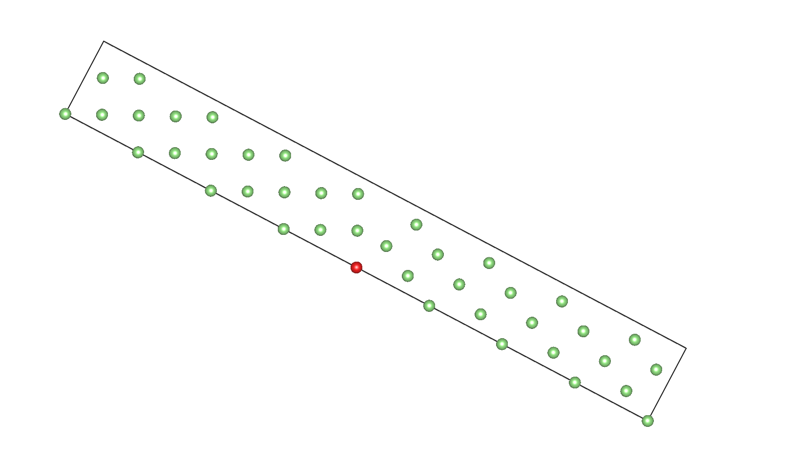

# **不要迷信科学**

* TOC
{:toc}

# 参考书

Cai, W., & Nix, W. (2016). Imperfections in Crystalline Solids (MRS-Cambridge Materials Fundamentals). Cambridge: Cambridge University Press. doi:10.1017/CBO9781316389508

# macroscopic degree of freedom=5

宏观上晶界的自由度总共有5个.其中3个来自interface operation,可以用orentational matrix或者rotation axis+angle表示.剩下两个来自于grain boundary plane normal

## interface operation-orientational matrix

例:

立方晶体1是立方结构的Li,假设其晶格常数a=b=c=1

令参考系的xyz轴与晶体1的abc轴分别对齐

则$$a_1=(1,0,0),b_1=(0,1,0),c_1=(0,0,1)$$

让晶体1图中红点为旋转点,相对自己的001轴顺时针旋转53.13度,产生了晶体2.

图从001角度观察晶体.红点左侧区域(包括红点)为晶体1,红点右侧为晶体2,需要自行添加周期性条件脑补

$

通过图中可以看出,晶体2相当于a轴和b轴顺时针旋转了53.13度,而c轴不变.旋转之后晶体2的abc轴分别是

$$a_2=(cos(-53.13),sin(-53.13),0)=(0.6,-0.8,0)$$

$$b_2=(sin(53.13),cos(53.13),0)=(0.8,0.6,0)$$

$$c_2=(0,0,1)$$

可以通过orientational matrix来描述他们之间的方向关系.

$$R_{12}=\left\{\begin{matrix}
a_1\cdot a_2&a_1\cdot b_2&a_1\cdot c_2\\
b_1\cdot a_2&b_1\cdot b_2&b_1\cdot c_2\\
c_1\cdot a_2&c_1\cdot b_2&c_1\cdot c_2\\
\end{matrix}\right\}$$

代入可得

$$R_{12}=\left\{\begin{matrix}
(1,0,0)\cdot (0.6,-0.8,0)&(1,0,0)\cdot (0.8,0.6,0)&(1,0,0)\cdot (0,0,1)\\
(0,1,0)\cdot (0.6,-0.8,0)&(0,1,0)\cdot (0.8,0.6,0)&(0,1,0)\cdot (0,0,1)\\
(0,0,1)\cdot (0.6,-0.8,0)&(0,0,1)\cdot (0.8,0.6,0)&(0,0,1)\cdot (0,0,1)\\
\end{matrix}\right\}$$

$$R_{12}=\left\{\begin{matrix}
0.6&0.8&0\\
-0.8&0.6&0\\
0&0&1\\
\end{matrix}\right\}$$

这个矩阵意义在于,晶体1中任意矢量可以通过此矩阵转化为晶体2中的矢量

即$$vec_2=R_{12}vec_1$$

比如晶体1中的(210)方向在晶体2中是

$$R_{12}\left\{\begin{matrix}
2\\
1\\
0\\
\end{matrix}\right\}=\left\{\begin{matrix}
0.6&0.8&0\\
-0.8&0.6&0\\
0&0&1\\
\end{matrix}\right\}\left\{\begin{matrix}
2\\
1\\
0\\
\end{matrix}\right\}=\left\{\begin{matrix}
0.6*2+0.8*1+0*0\\
-0.8*2+0.6*1+0*0\\
2*0+1*0+0*1\\
\end{matrix}\right\}=\left\{\begin{matrix}
2\\
-1\\
0\\
\end{matrix}\right\}$$

## interface operation:axis-angle representation

两个方向任意的晶体A和B,B一定可以通过将A绕某个轴旋转一定角度并且进行一定的平移得到(旋转轴-角度的组合不唯一,由于周期性,平移也不唯一)

例如$$\Sigma 5(210) $$晶界,可以通过绕001轴旋转53.13度,也可以绕210轴旋转180度

虽然旋转轴有三个坐标,但是只有两个自由度.因为旋转轴是单位矢量,其第三个坐标没有自由度.或者换一种角度,放在球坐标中,只有其角度部分是自由度,长度部分不算自由度.即,在表示自由度的时候需要这么理解旋转轴

旋转轴与角度的关系通过如下方式定义:

令旋转轴$$t_R=\left\{\begin{matrix}
t_{R_x}\\
t_{R_y}\\
t_{R_z}\\
\end{matrix}\right\}=\left\{\begin{matrix}
cos\alpha_rsin\phi_r\\
sin\alpha_rsin\phi_r\\
cos\phi_r\\
\end{matrix}\right\}$$

旋转角度为$$\theta$$

首先定义

$$Z_{12}=\left\{\begin{matrix}
cos\alpha_rcos\phi_r&sin\alpha_rcos\phi_r&-sin\phi_r\\
-sin\alpha_r&cos\alpha_r&0\\
cos\alpha_rsin\phi_r&sin\alpha_rsin\phi_r&cos\phi_r\\
\end{matrix}\right\}$$

其具有性质

$$Z_{12}\cdot t_R=\left\{\begin{matrix}
0\\
0\\
1\\
\end{matrix}\right\}$$

以及绕001旋转theta度的旋转矩阵是

$$g(\theta)=\left\{\begin{matrix}
cos\theta&-sin\theta&0\\
sin\theta&cos\theta&0\\
0&0&1\\
\end{matrix}\right\}$$

则有

$$R_{12}=Z_{12}^T\cdot g(\theta)\cdot Z_{12}$$

$$R_{12}=\left[\begin{matrix}\sin^{2}{\left(\alpha \right)} \cos{\left(\theta \right)} + \sin^{2}{\left(\phi \right)} \cos^{2}{\left(\alpha \right)} + \cos^{2}{\left(\alpha \right)} \cos^{2}{\left(\phi \right)} \cos{\left(\theta \right)} & - \sin{\left(\alpha \right)} \sin^{2}{\left(\phi \right)} \cos{\left(\alpha \right)} \cos{\left(\theta \right)} + \sin{\left(\alpha \right)} \sin^{2}{\left(\phi \right)} \cos{\left(\alpha \right)} - \sin{\left(\theta \right)} \cos{\left(\phi \right)} & \left(\sin{\left(\alpha \right)} \sin{\left(\theta \right)} - \cos{\left(\alpha \right)} \cos{\left(\phi \right)} \cos{\left(\theta \right)} + \cos{\left(\alpha \right)} \cos{\left(\phi \right)}\right) \sin{\left(\phi \right)}\\- \sin{\left(\alpha \right)} \sin^{2}{\left(\phi \right)} \cos{\left(\alpha \right)} \cos{\left(\theta \right)} + \sin{\left(\alpha \right)} \sin^{2}{\left(\phi \right)} \cos{\left(\alpha \right)} + \sin{\left(\theta \right)} \cos{\left(\phi \right)} & - \sin^{2}{\left(\alpha \right)} \sin^{2}{\left(\phi \right)} \cos{\left(\theta \right)} + \sin^{2}{\left(\alpha \right)} \sin^{2}{\left(\phi \right)} + \cos{\left(\theta \right)} & \left(- \sin{\left(\alpha \right)} \cos{\left(\phi \right)} \cos{\left(\theta \right)} + \sin{\left(\alpha \right)} \cos{\left(\phi \right)} - \sin{\left(\theta \right)} \cos{\left(\alpha \right)}\right) \sin{\left(\phi \right)}\\\left(- \sin{\left(\alpha \right)} \sin{\left(\theta \right)} - \cos{\left(\alpha \right)} \cos{\left(\phi \right)} \cos{\left(\theta \right)} + \cos{\left(\alpha \right)} \cos{\left(\phi \right)}\right) \sin{\left(\phi \right)} & \left(- \sin{\left(\alpha \right)} \cos{\left(\phi \right)} \cos{\left(\theta \right)} + \sin{\left(\alpha \right)} \cos{\left(\phi \right)} + \sin{\left(\theta \right)} \cos{\left(\alpha \right)}\right) \sin{\left(\phi \right)} & \sin^{2}{\left(\phi \right)} \cos{\left(\theta \right)} + \cos^{2}{\left(\phi \right)}\end{matrix}\right]$$

其关系为

$$t_{R_x}=\frac{b_1\cdot c_2-c_1\cdot b_2}{2sin\theta}$$

$$t_{R_y}=\frac{a_1\cdot c_2-c_1\cdot a_2}{2sin\theta}$$

$$t_{R_z}=\frac{a_1\cdot b_2-b_1\cdot a_2}{2sin\theta}$$

可以验证$$t_R=\left\{\begin{matrix}
t_{R_x}\\
t_{R_y}\\
t_{R_z}\\
\end{matrix}\right\}=\left\{\begin{matrix}
cos\alpha_rsin\phi_r\\
sin\alpha_rsin\phi_r\\
cos\phi_r\\
\end{matrix}\right\}$$

验证:

对应于旋转53.5度

其旋转轴是$$t_R=\left\{\begin{matrix}
\frac{(0,1,0)\cdot (0,0,1)-(0,0,1)\cdot (0.8,0.6,0)}{2sin53.5}\\
\frac{(1,0,0))\cdot (0,0,1)-(0,0,1)\cdot (0,6,-0.8,0)}{2sin53.5}\\
\frac{(1,0,0)\cdot (0.8,0.6,0)-(0,1,0)\cdot  (0,6,-0.8,0)}{2sin53.5}\\
\end{matrix}\right\}=\left\{\begin{matrix}
\frac{0-0}{2sin53.5}\\
\frac{0-0}{2sin53.5}\\
\frac{0.8+0.8}{2*0.8}\\
\end{matrix}\right\}=\left\{\begin{matrix}
0\\0\\1\\
\end{matrix}\right\}$$

也就是说,比如通过一个已知旋转轴和角度得到了一个orientational matrix,想要得到在另一个旋转轴的等效角度,那么就带进去Z求g矩阵,反则反之

$$ Z_{12}^{-1}R_{12}Z_{12}^{T-1}=g(\theta)$$

## grain boundary plane normal

首先:晶界平面法线:grain boundary plane normal

这个在参考书《Cai, W., & Nix, W. (2016). Imperfections in Crystalline Solids (MRS-Cambridge Materials Fundamentals). Cambridge: Cambridge University Press. doi:10.1017/CBO9781316389508》中第437页图13.1有极好的表述.展示了这个grain boundary plane normal和旋转轴的区别

这部分带来了额外的两个自由度

grain boundary plane的表示法:

$$n_B=\left\{\begin{matrix}
cos\alpha_B sin\phi_B\\
sin\alpha_B sin\phi_B\\
cos\phi_B\\
\end{matrix}\right\}$$

$$n_B=t_R$$,twist
$$n_B\cdot t_R=0$$,tilt

其他情况下:混合

# microscopic degree of freedom

晶界还有几个微观自由度. 

除此之外,两个晶体还可以在旋转之后做相对的平移.有两个自由度是在grain boundary平面内的平移,比如对于NaCl,平移之前可能是Cl对Cl,Na对Na,平移之后是交错着.而垂直于grain boundary plane方向的平移,不知道算不算自由度.因为垂直方向只有一个特定距离是能量最低的,很难将这个是自由度.

# Energy

## grain boundary formation energy

## adhesion energy
- https://aip.scitation.org/doi/full/10.1063/1.4795300
$$W_{adhesion}= \frac{E_{slab1}+E_{slab2}-E_{IF}}{2A}$$ 其中slab1slab2是两个晶粒在slab状态下的能量。IF是整个晶界模型的能量，没有说有没有限定方向收敛
- https://journals-aps-org.libproxy1.nus.edu.sg/prb/pdf/10.1103/PhysRevB.67.115415
    - work of adhesion: 同上

- https://pubs.rsc.org/en/content/articlelanding/2022/TA/D2TA02202H#cit41
    $$W_{adhesion}=\gamma_a+\gamma_b-E_f=\frac{E_{slab1}-E_{bulk1}}{2S}+\frac{E_{slab1}-E_{bulk1}}{2S}-\frac{E_{interface}-E_{bulk1}-E_{bulk2}}{2A}=\frac{E_{slab1}+E_{slab2}-E_{IF}}{2A}$$
    也就是说还是一样的

## interface formation energy:
energy gain to create one unit of interface from bulk material
- https://journals-aps-org.libproxy1.nus.edu.sg/prb/pdf/10.1103/PhysRevB.67.115415
    固定方式：slab的三个最外层原子可以移动，中间层的尺寸锁定-》即至少锁定了XY，不知道Z方向如何
    感觉应该也是锁定的
    bulk肯定是relax之后的了
    In the relaxed calculations, all atoms in the three outermost layers on each side of
    each slab are allowed to relaxed in all directions. The supercell size and the atomic positions in the middle layers are
    kept the same as in the unrelaxed system
    $$\gamma = \frac{E_{interface}-E_{bulk1}-E_{bulk2}}{2A}$$

## surface energy 
- https://journals-aps-org.libproxy1.nus.edu.sg/prb/pdf/10.1103/PhysRevB.67.115415
    固定方式：slab的三个最外层原子可以移动，中间层的尺寸锁定-》即至少锁定了XY，不知道Z方向如何
    In the relaxed calculations, all atoms in the three outermost layers on each side of
    each slab are allowed to relaxed in all directions. The supercell size and the atomic positions in the middle layers are
    kept the same as in the unrelaxed system
    $$\sigma = \frac{E_{slab1}-E_{bulk1}}{2A}$$
