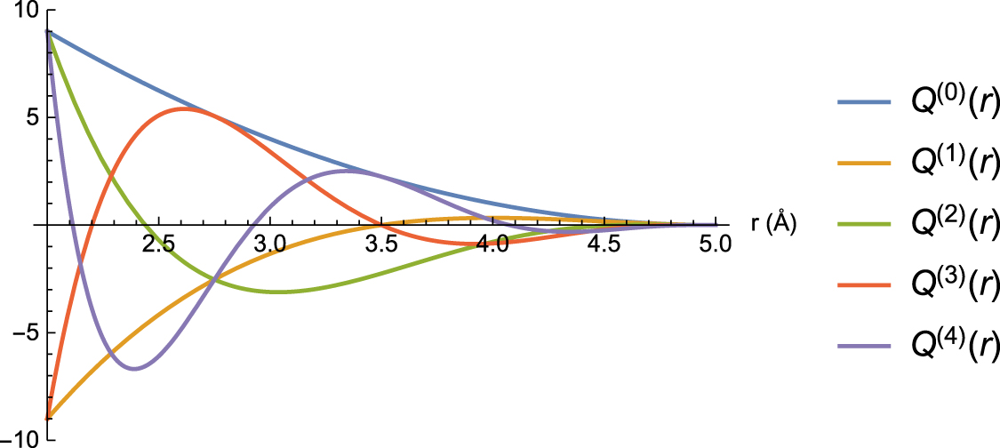
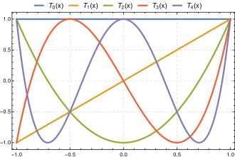
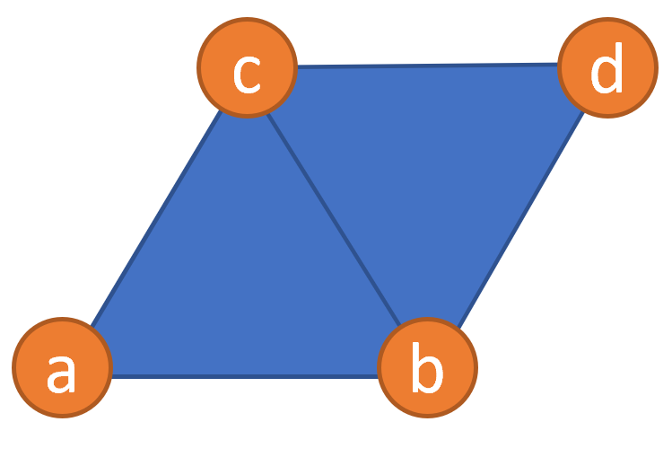

# 我已经完全悸动起来了!

**Phillies, George DJ. Elementary lectures in statistical mechanics. Springer Science & Business Media, 2000.**
**Guha, E. Statistical Mechanics: An Introduction. Alpha Science International, 2008.**
*https://iopscience.iop.org/article/10.1088/2632-2153/abc9fe*

* TOC
{:toc}

# Ensemble

为了定义系统,取整个世界,或者整个世界的模型, 的一部分来作为所谓的system.而system以外的部分是bath. 对于这个系统,如果希望能够应用在统计物理学中,则必须满足“能够有完整的对其微观状态的描述”此条件(any system that can be treated by statistical mechanics can be given a complete, microscopic description.).例如,对于牛顿系统,一个完整的对微观状态的描述可以是:每个原子的坐标以及动量.对于量子系统,则可以是所有basis vector的幅度和相.对于system必须有完整的表述,但是对于bath的话,无所谓

- State: 
通过微观的变量(例如对于传统系统是原子坐标和动量,对于quantum system: amplitude and phased for each basis vector)来描述微观状态,那么当所有微观变量取了一个值之后,得到了一个state.每个state都对应一个唯一的微观变量们的取值

- number of microstate: $\Omega$
大omega是满足某个条件的所有state的数量,比如NVE ensemble中满足N=1,V=2,E=3的state总共有100个,则为
$$\Omega_{(N=1,V=2,E=3)}=100$$

- entropy:
在NVE ensemble中,entropy满足
$$S=k_B \Omega(N,V,E)$$

- Ensemble:
指这个系统所有unique state的集合. 每个state都是这个ensemble的element. 一般情况下ensemble都是在对系统施加了某个限定条件之后的state集合.(NVT之类的)

- element of ensemble:
一个allowed state, 用来组成ensemble

- Mechanical Variable:
a function whose value can be calculated from the microscopic description of a single element of an ensemble.即可以通过element计算出来的物理性质,比如压强,自由能,动能,熵...

- ensemble average:
对于某个系统,将其复制许多份,对于每个复制进行观察,这些系统会处于不同的state,对于所有这些复制体的mechanical variable进行观测,取平均,是ensemble average

- phase space
例如,单个粒子具有position vector和canonically conjugate momentum vector. 投影到cartesian space这两个vector可以表示为$$x,y,z,p_x,p_y,p_z$$,即6个坐标.对于含有这6个坐标轴的空间,此空间中的一个点可以独特地定义一个系统的state. 对于含有N个粒子的系统,则有6N个坐标.此6N个坐标组成的space就是phase space.

- phase point
在phase space中的一个点,这个点对应的是一个state. 一般写作
$$\Gamma=(r^N,p^N)$$
例如一个只含有一个粒子的系统,此粒子位于(1,2,3),具有4,5,6的动能则
$$\Gamma=(1,2,3,4,5,6)$$
此$$\Gamma$$点,即phase point,对应了这个系统的一个state

# types of ensemble

## microcanonical ensemble:NVE
因为E是固定的,所以stastistical weight是一个常数
- 如果严格要求E=E0,成为surface ensemble
- 如果考虑quantum system,有时候能量不是连续的,所以保持E不变是比较难以实施的(具体在P33),所以此时变为quantum microcanonical ensemble,要求E保持在$$E_0+\delta E$$此极小范围内.
对于一个仅固定了N和V的系统,其能量可以从0到正无穷,microcasnonical ensemble取其中所有满足E=E0(surface ensemble)或者$$E_0+\delta E$$(quantum)此条件的state(element)组成ensemble

## canonical ensemble:NVT
指NVT ensemble,即在固定粒子数量,体积,温度情况下的ensemble/state集合.所有允许的state之间NVT都是一样的

- stastistical weight是$$W_j=Ce^{-\frac{E_j}{k_BT}}$$

- 从而常数C: $$C=\frac{1}{\sum_j e^{-\beta E_j}}$$

- Probability Distribution: $$P(E=E_j)=\frac{e^{-\beta E_j}}{\sum_j e^{-\beta E_j}}$$

- partition function: $$Z={\sum_j e^{-\beta E_j}}$$

## grand canonical ensemble: $$\mu VT$$
可以理解为对许多个N不一样但是VT一样的canonical ensemble的集合中,取其中$$\mu = \mu_0 $$的所有element组成一个ensemble
或者说
对于所有满足$$V=V_0, T=T_0$$而N随意取值(0~正无穷)的canonical ensemble,其组成一个canonical ensemble 的集合,对于所有满足了mu的element,提取出来组成grand canonical ensemble

## isothermal-isobaric ensemble: NTP

## isodynamic-polythermal ensembleL NVE, 与microcanonical ensemble不同之处在于其stastistical weight的定义不一样

# MLIP
*https://iopscience.iop.org/article/10.1088/2632-2153/abc9fe*
MACHINE learning potential: moment tensor potential 

设定一个例子:

一个Na原子(编号1,坐标0,0,0),周围有两个O原子(编号23,坐标010,002)和一个P原子(编号4,坐标110)
mtp中cutoff min=0.8, cutoff max=2.5

## Neighbor: 周围环境:由$$n_i$$此集合描述

$$n_i=[z_i,z_j,r_{ij}]$$

例如对于Na原子

$$n_1=[z_1,z_2,r_{12},z_3,r_{13},z_4,r{14}]=[11,8,1,8,2,15,1.414]$$

## radial basis function:

$$Q^{\beta}(|r_{ij}|)= \phi^{\beta}(R_{cut}-r_{ij}^2)\space when\space |r_{ij}|<R_{cut}$$

$$Q^{\beta}(|r_{ij}|)= 0 \space when\space |r_{ij}|>R_{cut}$$

其中phi是在$$[R_{min},R_{cut}]$$区间上的chebyshev polynomials,beta是chebyshev polynomial的级数
对于前几级别

*cite from https://iopscience.iop.org/article/10.1088/2632-2153/abc9fe*

1. Q0

$$Q^{0}(|r_{ij}|)= (R_{cut}-|r_{ij}|)^2=(2.5-|r_{ij}|)^2$$

$$Q^{0}(|r_{ij}|=R_{cut})= 0$$

$$Q^{0}(|r_{ij}|=R_{min})= (R_{cut}-|r_{ij}|)^2=(2.5-0.8)^2=2.89$$

2. Q1

$$Q^{1}(|r_{ij}|)= (\frac{2r_{ij}-R_{cut}-R_{min}}{R_{cut}-R_{min}})(R_{cut}-|r_{ij}|)^2=(\frac{2r_{ij}-3.3}{1.7})(2.5-|r_{ij}|)^2$$

$$Q^{1}(|r_{ij}|=R_{cut})= (\frac{2R_{cut}-R_{cut}-R_{min}}{R_{cut}-R_{min}})(R_{cut}-R_{cut})^2=(R_{cut}-R_{cut})^2=0$$

$$Q^{1}(|r_{ij}|=R_{min})= (\frac{2R_{min}-R_{cut}-R_{min}}{R_{cut}-R_{min}})(R_{cut}-|r_{ij}|)^2=-(R_{cut}-R_{min})^2=-2.89$$

3. Q2

$$Q^{2}(|r_{ij}|)= [2(\frac{2r_{ij}-R_{cut}-R_{min}}{R_{cut}-R_{min}})^2-1](R_{cut}-|r_{ij}|)^2$$

$$Q^{2}(|r_{ij}|=R_{cut})= (2*(-1)^2-1)(R_{cut}-R_{cut})^2=(R_{cut}-R_{cut})^2=(R_{cut}-R_{cut})^2=0$$

$$Q^{2}(|r_{ij}|=R_{min})= (2*1^2-1)(R_{cut}-|r_{ij}|)^2=(R_{cut}-R_{min})^2=2.89$$

- 更高形式参考wikipedia的第一类切比雪夫多项式

## radial part
$$f_{\mu}(n_{ij})=f_{\mu}(|r_{ij},z_i,z_j|)=\sum^{N_Q}_{\beta=1}c^{\beta}_{\mu,z_i,z_j}Q^{\beta}(|r_{ij}|)$$

$$N_Q$$是beta/切比雪夫不等式的最高级数,越大精度越高?
虽然似乎文章里面beta(切比雪夫多项式的级数是从1开始的),为了方便,假设从0开始,当$$N_Q=1$$,示例对于Na-P

$$f_{\mu}(Na-P)=f_{\mu}(|r_{Na,P},Na,P|)=\sum^{2}_{\beta=1}c^{\beta}_{\mu,Na,P}Q^{\beta}(|r_{Na,P}|)$$

$$=c^{0}_{\mu,Na,P}(2.5-|r_{Na-P}|)^2+c^{1}_{\mu,Na,P}(\frac{2|r_{Na-P}|-3.3}{1.7})(2.5-|r_{Na-P}|)^2$$

*https://en.wikipedia.org/wiki/Chebyshev_polynomials*

在MLIP的软件包里面给的所有的untrained potential里面的Nq=8

## angular part

$$angular_v=r_{ij}\otimes r_{ij} \otimes ....(v \space times)$$

对于neighbor求n次外积(outer product)

v=0, angular=1
v=1, $$angular=r_{ij}=(x_{ij},y_{ij},z_{ij})$$
v=2 看文章,是3*3矩阵
看起来是个与v相关的tensor?

## moment tensor

$$M_{\mu,v}(n_i)=\sum_j f_{\mu}(|r_ij|)*angular$$

$$M_{0,1}(Na)=\sum_j f_{0}(|r_ij|)*(x_{ij},y_{ij},z_{ij})=[c^{0}_{0,Na,P}(2.5-|r_{Na-P}|)^2+c^{1}_{0,Na,P}(\frac{2|r_{Na-P}|-3.3}{1.7})(2.5-|r_{Na-P}|)^2](x,y,z)+...=[c^{0}_{0,Na,P}(2.5-1.414)^2+c^{1}_{\mu,Na,P}(\frac{2.828-3.3}{1.7})(2.5-1.414)^2](1,1,0)+....$$

只写出来了Na和P,省略号的是Na和其他neighbor

## level

$$lev[M]=2+4\mu+v$$

这个是MLIP的level,可见随$$\mu$$增长很快,在v是0情况下,v=0时候level是2,v=1 (也就是说,有两组radial part)的level就已经是6了.

## basis functions
$$B_{\alpha}=M_{\mu,v}$$  
$$lev[B]=2+4\mu+v$$
例如,level小于等于8的basis function总共有9个,即B0到B8,每个basic function有不同的mu或者v,也或者可能由低level的function组合而成

level限制住了mu的数量

## total energy
$$E=\sum_i V(n_i)=\sum_i \sum_{\alpha}\xi_{\alpha}B_{\alpha}(n_i)$$
# cluster expansion

比如说这样一个lattice

- site:
一共有4个site， a,b,c,d
- state
总共有$$2^4=16$$个state
- occupation variables $$\sigma_i$$:
在site i上面的occupation
例如在a上面有occupy的原子，则$$\sigma_a=1$$
- occupation vector $$\vec{\sigma}$$
$$\vec{\sigma}=(\sigma_a,\sigma_b,\sigma_c,\sigma_d)$$
例如在state0下面的occupation vector是
$$\vec{\sigma_0}=(-1,1,1,-1)$$
- cluster: $$\alpha$$
比如，单个site可以是一个cluster
两个比较近的site可以是一个cluster
例如$$\alpha=(a)$$
$$\beta=(a,b)$$
$$\gamma=(a,d)$$
$$\delta=(a,b,c)$$
- cluster function 
$$\sigma_{\alpha}(\vec{\sigma})=\prod_{i\in \alpha}\sigma_i $$
例如对于$$\vec{\sigma_0}=(-1,1,1,-1)$$
$$\sigma_{\alpha}(\vec{\sigma_0})=\prod_{i\in \alpha}\sigma_i=\prod_{i\in (a))}\sigma_i=\sigma_a=-1$$
$$\sigma_{\beta}(\vec{\sigma_0})=\prod_{i\in \beta}\sigma_i=\prod_{i\in (a,b))}\sigma_i=\sigma_a*\sigma_b=(-1)*1=-1$$
$$\sigma_{\delta}(\vec{\sigma_0})=\prod_{i\in \delta}\sigma_i=\prod_{i\in (a,b,c))}\sigma_i=\sigma_a*\sigma_b*\sigma_c=-1*1*1=-1$$
