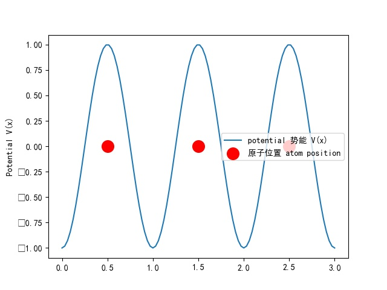
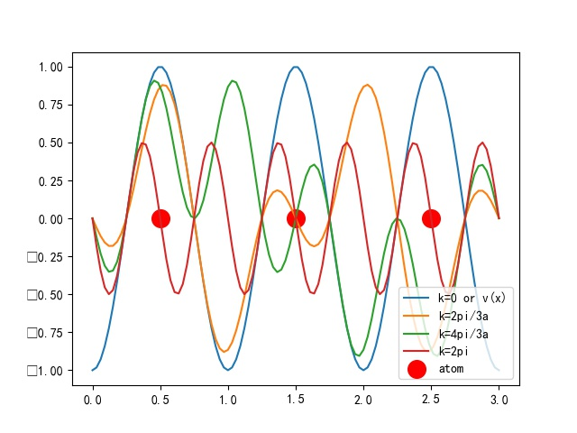

Remake@21.10.22
Revision@22.03.05 from MLE5215

# What I cannot create, I do not understand.

# 不要再迷信科学了

* TOC
{:toc}

# 必备知识（或者说一些写法之类的）

## Born-oppenheimer approximation 

由于原子核质量远大于电子，在计算电子的一些性质时可以假设原子不动

## bracket

$$<\hat{O}>=<\Phi|\hat{O}|\Phi>=\int\int\int...\int\Phi^*\hat{O}\Phi dx_0dx_1.....dx_n$$

## 泛函

方括号是泛函的意思。泛函类似于函数，函数是输入未知数得到一个结果，或者说数到数的对应。而泛函是输入一个函数得到一个数，或者说函数到数的映射。比如说，一个泛函的形式是从0到1积分，那么输入f(x)=x+1这个函数，得到的是数字1.5。泛函跟函数的表达方式类似，但是把圆括号变成方括号

$$ n(r) -- E[] --> E[n(r)] $$

## fourier transformation

转载自 wikipedia

转载自_https://zhuanlan.zhihu.com/p/19763358_，这个讲的很清楚

## 物质的性质与电子的关系
_Richard M Martic, Electronic Structure: Basic theory and Practical method_
物质的所有性质可以被划分为两种，第一种是可以由基态电子决定的性质，第二种是可以由激发态电子来决定的性质

由于原子核质量远大于电子，所以相对电子来说是精致的（波恩奥本海默近似），所以电子决定了物质的绝大部分性质

基态电子可以决定物质的这些性质：cohesive energy内聚能， equilibrium crystal structure晶体结构， phase transitions 相变，elastic constant弹性常数 charge density电荷密度，magneticorder， static dielectric and magnetic susceptibilities, nuclear vibrations and motion, etc....

激发态电子决定了：specific heat 热容,pauli spin susceptibility, transport, insulating gap电阻, optical properties, spectra 光谱

DFT的主要目的：研究基态电子所对应的物质性质

## bonding：
一般认为分为5类：
closed shell system:稀有气体
ionic
metallic
covalent
hydrogen:比较特殊，因为氢原子是唯一没有core electron的 （往上面的氦的core electron是1s的两个电子）

实际材料的bonding一般是这五种的结合

# 度量衡

## Hartree atomic units

$$\hbar =m_e = e = 4\pi /\epsilon_0 = 1$$

## Notation，那堆符号

定义以上单位为1，用来简化计算
取自MLE5215

notation and symbol 

区分这些符号是非常重要的.以下全部假设空间是一维的.扩充到三维只需要把变量和量子数从1变成3,或者说,x变成(x,y,z)或者($$r,\theta,\phi$$),量子数$$n,m_s$$变成$$n,l,m_l,m_s$$

- 电子数量N

体系中电子数量，N

- $$\Psi^{n_0,n_1,...n_?,m_{s}^0,m_{s}^1,...m_{s}^{N}}(x_0,x_1,...x_N,\alpha_0(\sigma_0),\alpha_1(\sigma_1)...\alpha_N(\sigma_N))$$, Psi

true wave function: 真正的(实际的)原子波函数,可以是单个电子体系,也可以是多个电子体系,N是总共的电子数.包含了来自于原子核和电子的所有信息.对于多个电子体系来讲这个Psi是个根本就无法表示也求不出来的理想值,是我们想要去趋近的值.**另外,这个波函数的变量数目是灵活的,取决于你考虑什么。他可以是spin的函数,或者时间的函数,也可以不考虑这两个变量.因为spin,时间,和电子坐标这三个东西应该说，是不会互相影响，还是说，线性不相关？所以(或许)把他们劈开看是没什么问题的**,至于量子数,我也不知道这个有多少个量子数，可能是3*电子数，也可能不是。在N>=2不可解，无法求本征值

- $$\Psi_{ele}^{n_0,n_1,...n_?,m_{s}^0,m_{s}^1,...m_{s}^{N}}(x_0,x_1,...x_N,\alpha_0(\sigma_0),\alpha_1(\sigma_1)...\alpha_N(\sigma_N))$$, Psi——electron

True electronic wave function: 真正的(实际的)电子波函数,只表示电子部分而不表示原子部分.但是复杂度与Psi是一样的,因为原子部分只是一个常数(或者说随原子间距简单变化的值)

- $$\phi^{n}(x)$$,phi

Spatial orbital / Monoelectron Orbital / Hydrogen like orbital:没有包含电子自旋信息的（也不需要包含电子自旋信息的）,真实类氢原子单电子波函数/单电子轨道.可以在数值或者形式上精确且完整地表达出来的波函数。可求本征值,其就是single electron schrodinger方程的解.其能量是真实能量,本征态是真实本征态,有实际的物理意义.与$$\chi，\psi$$不同在于，其量子数(一维下是n,三维下是三个量子数n,l,$$m_l$$)是一个变量,而不是预先定好的。会随能量不同而变化，反映出不同能级。$$\phi^{n}(x)$$是具有实际物理含义而且是真实描述了单电子体系中电子的波函数的。

- $$\psi^{n_0,m_{s_0}}(x,\alpha(\sigma))$$,psi

在LCAO方法中,量子数确定的，单个类氢原子单电子波函数/单电子轨道,可以在数值或者形式上精确且完整地表达出来的波函数,有唯一明确形式,位置x和电子自旋是变量,可求本征值,与$$\phi^{n}(x)$$不同的是,其量子数(一维下是n,三维下是三个量子数)是固定的（或者提前确定好的）.或者说，$$\psi^{n_0,m_{s_0}}(x,\alpha(\sigma))$$是$$n=n0,m_s=m_{s_0}$$时候的$$\phi^{n}(x)$$。在LCAO方法中用来组成$$\chi$$.K个具有不同量子数的$$\psi^{n_i}(x)$$组成了一个$$\chi^{n_1,n_2,...,n_K,m_{s_1},m_{s_2},...m_{s_K}}(x,\alpha(\sigma))$$

- $$\chi^{n,m_s}(x,\alpha(\sigma))$$，或者$$\chi^{n_1,n_2,...n_K,m_{s_1},m_{s_2},...m_{s_{K}}}_{LCAO:c_1,c_2,...c_{K}}(x,\alpha(\sigma))$$,chi

    spin orbital: 包括了spin信息的单电子波函数/单电子轨道。未必是类氢原子的，也可以是多电子体系中某单个电子的波函数

    是用来组合出slater determinant，作为slater行列式中的单个元素存在

    可以表示真实的原子轨道，也可以表示近似的原子轨道。一般对于单电子体系，表示真实原子轨道；对于多电子体系，表示（通过LCAO或者其他方法）近似出来的原子轨道

    - 如果表示真实波函数:

        如果在单电子体系中，则有明确解，可以表示为$$\chi^{n,l,m_{l},m_{s}}(x,y,z,\alpha(\sigma))=\chi^{n,l,m_{l},m_s}(r,\theta,\phi,\alpha(\sigma))=\phi^{n,l,m_l}(r,\theta,\phi)\alpha^{m_s}(\sigma)=\Psi^{n,l,m_l,m_s}(r,\theta,\phi,\alpha(\sigma))$$。

        但如果是多电子体系，则其函数是未知的。n是一个变量集合，而且不知道有多少个量子数，而且如果组合成slater determinant，则slater determinant也是无法表示，不可解的

        所以一般在单电子体系中，表示的是真实的自旋轨道

    - 如果是近似波函数

        也可以是近似出来的波函数,一般用来在多电子体系中组合出slater determinant。其中一种得到近似的$$\chi$$的方法是使用LCAO,对K个LCAO轨道$$\psi^{n_i}(x)$$进行线性组合,并且加入自旋部分，注意此时的量子数n是由LCAO决定的确定值，形式上发生了变化：

        $$\chi^{n_1,n_2,...n_K,m_{s_1},m_{s2},...m_{s_{K}}}_{LCAO:c_1,c_2,...c_{K}}(x,\alpha(\sigma))=[c_1\psi^{n_1,m_{s_1}}(x)+c_2\psi^{n_2,m_{s2}}(x)+...+c_{K}\psi^{n_K,m_{s_{K}}}(x)]\alpha(\sigma)=[\sum_{\mu=1}^{K}c_{\mu}\psi^{n_{\mu}}(x)]\alpha(\sigma)$$。

        以此种方法得到的spin orbital$$\chi$$可以在数值或者形式上精确且完整地表达出来的波函数,可解,可求本征值。以此种方法得到的spin orbital$$\chi$$的量子数是LCAO轨道们的量子数的集合，是固定的，不是变量

        但是，未必就要用LCAO方法来得到$$\chi$$，也可以（可能）有其他方法。（平面波基矢？不知道是不是）

- $$\Phi^{n_0,n_1,...n_{(K*N)},m_{s_1},m_{s_2},...m_{s_{K*N}}}(x_0,x_1,...x_N,\alpha_0(\sigma_0),\alpha_1(\sigma_1)...\alpha_N(\sigma_N))$$, Phi

Trial wave function: 指以Slater determinant形式模拟出来的波函数,不是实际的波函数.是由$$\chi^{n,m_s}(x,\alpha(\sigma))$$形成slater行列式组合出来的波函数.

如果$$\chi^{n,m_s}(x,\alpha(\sigma))$$可以在数值或者形式上精确且完整地表达出来的波函数，例如使用LCAO方法,将spin orbital近似为K个原子轨道的linear combination：$$\chi^{n,m_s}(x,\alpha(\sigma))\approx\chi^{n_1,n_2,...n_K,m_{s_1},m_{s2},...m_{s_{K}}}_{LCAO:c_1,c_2,...c_{K}}(x,\alpha(\sigma))$$，这里面除了x和spin都是常数

则N个电子的trial wave function可以表示成$$\Phi^{n_0,n_1,...n_{(K*N)},m_{s_1},m_{s_2},...m_{s_{K*N}}}(x_0,x_1,...x_N,\alpha_0(\sigma_0),\alpha_1(\sigma_1)...\alpha_N(\sigma_N))$$此形式。是数值或者形式上可以精确且完整地表达出来的波函数,可解,可求本征值,但是这个的本征值不是真实值,而是真实原子波函数的本征值的近似,根据variational theory其能量总高于真实波函数的真实能量.

- $$\alpha(\sigma),\beta(\sigma)$$
spin function, 表示电子自旋量的函数,不知道怎么表达(但是好像也不需要表达)

#  single electron schrodinger equation

单电子薛定谔方程,此体系中只有一个电子.在不考虑电子自旋时候(也不需要考虑,因为自旋部分的方程和其他未知量是不相关的,即使算微分也是直接就被扔在外面)

$$\hat{H}=-\frac{\hbar ^2 }{2m_e}\nabla^2-\frac{Ze^2}{4\pi\epsilon_0r}$$

此Hamiltonian用来求解真实波函数,所以是$$\Psi$$,在求解之前我们不知道这东西还依赖于量子数,所以没有写量子数的上标.

三维情况下:

$$-\frac{\hbar ^2 }{2m_e}\frac{d^2\Psi(x,y,z)}{dx^2}-\frac{\hbar ^2 }{2m_e}\frac{d^2\Psi(x,y,z)}{dy^2}-\frac{\hbar ^2 }{2m_e}\frac{d^2\Psi(x,y,z)}{dz^2}-\frac{Ze^2}{4\pi\epsilon_0\sqrt{x^2+y^2+z^2}}\Psi=E\Psi$$

解这个方程的话转化为球坐标比较方便

$$x=rcos\phi sin\theta$$
$$y=rsin\phi sin\theta$$
$$z=rcos\theta$$

得到

$$-\frac{\hbar^2 }{2m_e}\frac{d^2\Psi(r,\theta,\phi)}{d(rcos\phi sin\theta)^2}-\frac{\hbar ^2 }{2m_e}\frac{d^2\Psi(r,\theta,\phi)}{d(rsin\phi sin\theta)^2}-\frac{\hbar ^2 }{2m_e}\frac{d^2\Psi(r,\theta,\phi)}{d(rcos\theta)^2}-\frac{Ze^2}{4\pi\epsilon_0r}\Psi=E\Psi$$

我不会解这个东西，网上得到的转换是

$$-\frac{\hbar ^2 }{2\mu r^2}\frac{d[r^2\frac{d\Psi}{dr}]}{dr}-\frac{\hbar ^2 }{2\mu r^2 sin\theta}\frac{d[sin\theta \frac{d\Psi}{d\theta}]}{d\theta}-\frac{\hbar ^2 }{2\mu r^2sin\theta^2}\frac{d^2\Psi}{d\phi^2}-\frac{Ze^2}{4\pi\epsilon_0r}\Psi=E\Psi$$

$$-\frac{\hbar ^2 }{2\mu r^2}[2r\frac{d\Psi}{dr}+r^2\frac{d^2\Psi}{dr^2}]-\frac{\hbar ^2 }{2\mu r^2 sin\theta}[cos\theta\frac{d\Psi}{d\theta}+sin\theta\frac{d^2\Psi}{d\theta^2}]-\frac{\hbar ^2 }{2\mu r^2sin\theta^2}\frac{d^2\Psi}{d\phi^2}-\frac{Ze^2}{4\pi\epsilon_0r}\Psi=E\Psi$$

$$-\frac{\hbar ^2 }{\mu r}\frac{d\Psi}{dr}-\frac{\hbar ^2 }{2\mu }\frac{d^2\Psi}{dr^2}-\frac{\hbar ^2 cos\theta}{2\mu r^2 sin\theta}\frac{d\Psi}{d\theta}-\frac{\hbar ^2 }{2\mu r^2 }\frac{d^2\Psi}{d\theta^2}-\frac{\hbar ^2 }{2\mu r^2sin\theta^2}\frac{d^2\Psi}{d\phi^2}-\frac{Ze^2}{4\pi\epsilon_0r}\Psi=E\Psi$$

将波函数分成r部分和角度部分

$$\Psi(r,\theta,\phi)=R(r)Y(\theta,\phi)$$

$$-\frac{\hbar ^2 }{\mu r}\frac{d(R(r)Y(\theta,\phi))}{dr}-\frac{\hbar ^2 }{2\mu }\frac{d^2(R(r)Y(\theta,\phi))}{dr^2}-\frac{\hbar ^2 cos\theta}{2\mu r^2 sin\theta}\frac{d(R(r)Y(\theta,\phi))}{d\theta}-\frac{\hbar ^2 }{2\mu r^2 }\frac{d^2(R(r)Y(\theta,\phi))}{d\theta^2}-\frac{\hbar ^2 }{2\mu r^2sin\theta^2}\frac{d^2(R(r)Y(\theta,\phi))}{d\phi^2}-\frac{Ze^2}{4\pi\epsilon_0r}(R(r)Y(\theta,\phi))=E(R(r)Y(\theta,\phi))$$

$$-\frac{\hbar ^2 }{\mu r}Y(\theta,\phi)\frac{dR(r)}{dr}-\frac{\hbar ^2 }{2\mu }Y(\theta,\phi)\frac{d^2R(r)}{dr^2}-\frac{\hbar ^2 cos\theta}{2\mu r^2 sin\theta}R(r)\frac{dY(\theta,\phi)}{d\theta}-\frac{\hbar ^2 }{2\mu r^2 }R(r)\frac{d^2Y(\theta,\phi)}{d\theta^2}-\frac{\hbar ^2 }{2\mu r^2sin\theta^2}R(r)\frac{d^2Y(\theta,\phi)}{d\phi^2}-\frac{Ze^2}{4\pi\epsilon_0r}R(r)Y(\theta,\phi)=ER(r)Y(\theta,\phi)$$

两边乘以$$\frac{r^2}{R(r)Y(\theta,\phi)}$$

$$-\frac{\hbar ^2 r}{\mu R(r)}\frac{dR(r)}{dr}-\frac{\hbar ^2 r^2}{2\mu R(r)}\frac{d^2R(r)}{dr^2}-\frac{\hbar ^2 cos\theta}{2\mu  sin\theta Y(\theta,\phi)}\frac{dY(\theta,\phi)}{d\theta}-\frac{\hbar ^2 }{2\mu  Y(\theta,\phi)}\frac{d^2Y(\theta,\phi)}{d\theta^2}-\frac{\hbar ^2 }{2\mu sin\theta^2 Y(\theta,\phi)}\frac{d^2Y(\theta,\phi)}{d\phi^2}-\frac{Ze^2r^2}{4\pi\epsilon_0}=E$$

由此将整个的hamiltonian算符分割成了两个部分

也就是说可以假设E=y+r（两个常数使得）

$$-\frac{\hbar ^2 r}{\mu R(r)}\frac{dR(r)}{dr}-\frac{\hbar ^2 r^2}{2\mu R(r)}\frac{d^2R(r)}{dr^2}-\frac{Ze^2r^2}{4\pi\epsilon_0}=r_0$$

$$-\frac{\hbar ^2 cos\theta}{2\mu  sin\theta Y(\theta,\phi)}\frac{dY(\theta,\phi)}{d\theta}-\frac{\hbar ^2 }{2\mu  Y(\theta,\phi)}\frac{d^2Y(\theta,\phi)}{d\theta^2}-\frac{\hbar ^2 }{2\mu sin\theta^2 Y(\theta,\phi)}\frac{d^2Y(\theta,\phi)}{d\phi^2}=y_0$$

这里相当于解也不知道叫啥（常微分？）方程

然后继续分割角度部分

$$-\frac{\hbar ^2 cos\theta}{2\mu  sin\theta Y(\theta,\phi)}\frac{dY(\theta,\phi)}{d\theta}-\frac{\hbar ^2 }{2\mu  Y(\theta,\phi)}\frac{d^2Y(\theta,\phi)}{d\theta^2}-\frac{\hbar ^2 }{2\mu sin\theta^2 Y(\theta,\phi)}\frac{d^2Y(\theta,\phi)}{d\phi^2}=y_0$$

$$-\frac{\hbar ^2 cos\theta}{2\mu  sin\theta  \Theta(\theta)\Phi(\phi)}\frac{d \Theta(\theta)\Phi(\phi)}{d\theta}-\frac{\hbar ^2 }{2\mu   \Theta(\theta)\Phi(\phi)}\frac{d^2 \Theta(\theta)\Phi(\phi)}{d\theta^2}-\frac{\hbar ^2 }{2\mu sin\theta^2  \Theta(\theta)\Phi(\phi)}\frac{d^2 \Theta(\theta)\Phi(\phi)}{d\phi^2}=y_0$$

$$-\frac{\hbar ^2 cos\theta}{2\mu  sin\theta  \Theta(\theta)\Phi(\phi)}\Phi(\phi)\frac{d \Theta(\theta)}{d\theta}-\frac{\hbar ^2 }{2\mu   \Theta(\theta)\Phi(\phi)}\Phi(\phi)\frac{d^2 \Theta(\theta)}{d\theta^2}-\frac{\hbar ^2 }{2\mu sin\theta^2  \Theta(\theta)\Phi(\phi)}\Theta(\theta)\frac{d^2 \Phi(\phi)}{d\phi^2}=y_0$$

$$-\frac{\hbar ^2 cos\theta}{2\mu  sin\theta  \Theta(\theta)}\frac{d \Theta(\theta)}{d\theta}-\frac{\hbar ^2 }{2\mu   \Theta(\theta)}\frac{d^2 \Theta(\theta)}{d\theta^2}-\frac{\hbar ^2 }{2\mu sin\theta^2  \Phi(\phi)}\frac{d^2 \Phi(\phi)}{d\phi^2}=y_0$$

$$-\frac{\hbar ^2 cos\theta sin\theta}{2\mu   \Theta(\theta)}\frac{d \Theta(\theta)}{d\theta}-\frac{\hbar ^2 }{2\mu   \Theta(\theta)}sin\theta^2\frac{d^2 \Theta(\theta)}{d\theta^2}-\frac{\hbar ^2 }{2\mu   \Phi(\phi)}\frac{d^2 \Phi(\phi)}{d\phi^2}=y_0sin\theta^2$$

得到

$$-\frac{\hbar ^2 }{2\mu   \Phi(\phi)}\frac{d^2 \Phi(\phi)}{d\phi^2}=\phi_0$$

和

$$-\frac{\hbar ^2 cos\theta sin\theta}{2\mu   \Theta(\theta)}\frac{d \Theta(\theta)}{d\theta}-\frac{\hbar ^2 }{2\mu   \Theta(\theta)}sin\theta^2\frac{d^2 \Theta(\theta)}{d\theta^2}=y_0sin\theta^2-\phi_0$$

实质上可以看出来，这两个之间是挺难分开的，干脆就是说，分不开。所以在解方程时候要先解phi的部分，将phi的结果代入theta.注意这个phi不是什么trial wave function,而是真实波函数的一部分.只是恰好这些有相同的希腊字母

- Azimuth part $$\Phi$$

  也就是$$\Phi$$

  $$-\frac{\hbar ^2 }{2\mu   \Phi(\phi)}\frac{d^2 \Phi(\phi)}{d\phi^2}=\phi_0$$

  有简单的解

  $$\Phi _m=c_1e^{im_l\phi}$$

  带回去得到

  $$-\frac{\hbar ^2 }{2\mu   c_1e^{im_l\phi}}[c_1(-m_l^2) e^{im_l\phi}]=\phi_0$$

  $$\frac{\hbar ^2m_l^2 }{2\mu }=\phi_0, (m_l=0,\pm 1,\pm 2, ...)$$

  大概能体会到这里面phi是一个在整个空间中比较均匀的项

- theta part $$\Theta$$

  一堆看不懂的多项式，随量子数变化非常复杂，而且是一个与phi有关的

  在解这个的同时，theta回对phi的量子数进行限制

  结果上来看的话

  (5215)

  $$P(cos\theta)=sin^m\theta(a_0\sum_{n=0}^{\infty}\frac{a_{2n}}{a_0}cos^{2n}\theta+a_1\sum_{n=1}^{\infty}\frac{a_{2n+1}}{a_1}cos^{2n+1}\theta)$$

  $$l=0,ml=0,p=1$$

  $$l=0,ml=0,p=sin\theta$$

  $$l=0,ml=1,p=cos\theta$$

  $$l=2,ml=0, p=1.5cos^2\theta-0.5$$

  $$l=2, ml=1, p=3cos\theta sin\theta=1.5cos2\theta$$

  $$l=2, ml=2, p=3-3cos^2\theta=3sin^2\theta$$

- R part

  $$-\frac{\hbar ^2 r}{\mu R(r)}\frac{dR(r)}{dr}-\frac{\hbar ^2 r^2}{2\mu R(r)}\frac{d^2R(r)}{dr^2}-\frac{Ze^2r^2}{4\pi\epsilon_0}=r_0$$

  解是

  $$R_{n,l}(r)=(c_3e^{i\sqrt{\frac{2\mu E}{\hbar^2}}r}+c_4e^{-i\sqrt{\frac{2\mu E}{\hbar^2}}r})b_le^{\frac{\mu Z e^2r}{2\pi \epsilon_0 \hbar^2 n}}$$
  n是主量子数，l是角量子数,b是一个与l相关的常数

## spatial orbital

已经解好了这几个部分的话,就可以得到单电子的,不考虑电子自旋时候的,spatial orbital(参考度量衡部分)
量子数反映了能级，不同量子数对应不同能级/激发态（不知道这么说对不对）

$$\phi^{n,l,m_l}(x,y,z)=\Psi^{n,l,m_l}(r,\theta,\phi)=R_{n,l}(r)\Phi_{m_l}(\phi)\Theta_{l,m_l}(\theta)$$

## Spin
spin有点像一个dummy项，$$s^{m_s}(\sigma), s=[\alpha , \beta],s取哪个由m_s决定$$
一个与xyz无关的项和波函数相乘，所以其实在计算时候不会影响，因为算微分之类的东西的时候直接就被分离跑了.对于单个电子来说，spin或许是个无所谓的东西？（虽然它确实会受到外在磁场的影响）但是在研究多电子体系的时候则必须将spin纳入考虑。

在考虑电子自旋之后此时的oribtal变成了spin orbital. 试试区分这两个。注意这个spin orbital是前面定义中，表示真实波函数的情形，其量子数为变量。

spatial orbital: $$\phi^{n,l,m_l}(x,y,z)=\phi^{n,l,m_l}(r,\theta,\phi)=\Psi^{n,l,m_l}(r,\theta,\phi)=R_{n,l}(r)\Phi_{m_l}(\phi)\Theta_{l,m_l}(\theta)$$

量子数是变量的spin orbital: $$\chi^{n,l,m_{l},m_{s}}(x,y,z,\alpha(\sigma))=\chi^{n,l,m_{l},m_s}(r,\theta,\phi,\alpha(\sigma))=\phi^{n,l,m_l}(r,\theta,\phi)\alpha^{m_s}(\sigma)=\Psi^{n,l,m_l,m_s}(r,\theta,\phi,\alpha(\sigma))$$

## 单电子schrodinger方程大约的最终形式

(可能少了几项,估计哪里可能写错了,但不重要,反正没人在乎对不对,我们只需要知道这东西是能表示出来的就彳亍.)

spin orbital: $$\chi_{n,l,m_l,m_s}(r,\theta,\phi,\alpha(\sigma))=R_{n,l}(r)\Phi_{m_l}(\phi)\Theta_{l,m_l}(\theta)\alpha^{m_s}(\sigma)=(c_3e^{i\sqrt{\frac{2\mu E}{\hbar^2}}r}+c_4e^{-i\sqrt{\frac{2\mu E}{\hbar^2}}r})b_le^{\frac{\mu Z e^2r}{2\pi \epsilon_0 \hbar^2 n}}c_1e^{im_l\phi}P(cos\theta)\alpha^{m_s}(\sigma)$$

对于单电子的波函数，spin有没有并不重要，因为不需要区分不同spin的电子，也没有第二个电子会占据这个轨道

所以以下几个函数是等价的：真实波函数，真实电子波函数，spatial orbital， spin orbital。 也就是说，$$\Psi, \Psi_{ele},\phi$$

注意，trial wavefunction和LCAO orbital并不表示真实波函数，因为这两个函数中的量子数是提前指定下来的常数。

## one-dimension single electron wavefunction

因为三维依旧是一个难以理解的波函数，所以这里有一个一维的单电子波函数供参照

一维单电子波函数有一个量子数n，这个应该没什么难理解的，就是表示波函数能级

由于波函数本身有很多常数，但是这个常数对于理解这个函数形式并不重要所以，所以直接将全部常数变成1

其完整形式在这篇文章里面可以看到（https://royalsocietypublishing.org/doi/10.1098/rspa.2015.0534#RSPA20150534M2x7）

$$\Psi_n(x)=e^{-|x|}L_n(|x|)$$

其中$$L_n$$是一个随n变化形式的方程，称作laguerre polynomial

对于前面几个n，其大概形式是

$$\Psi_1(x)=e^{-|x|}L_1(|x|)=e^{-|x|}(1-x)$$

$$\Psi_2(x)=e^{-|x|}L_2(|x|)=e^{-|x|}(x^2-4x+2)$$

$$\Psi_3(x)=e^{-|x|}L_3(|x|)=e^{-|x|}(-x^3+9x^2-18x+6)$$

...

为了理解起来方便，我把那堆常数换成了1，而Laguerre polynomial多项式中每项的常数（摘抄自wikipedia），也没必要拘泥于其具体数值。

# Manybody schrodinger equation

## 真实hamiltonian/算符

为了研究物质的物理性质，需要解电子的波函数，然后可以通过算符施加在波函数来获得性质（例如用hamiltonian获得基态能量）

多电子的,不考虑时间的,真实Hamiltonian写作如下形式：

$$\hat{H}=-\frac{\hbar ^2 }{2m_e}\sum_i\nabla_i^2-\sum_{i,I}\frac{Z_Ie^2}{r_i-R_I}+0.5\sum_{i\neq j}\frac{e^2}{|r_i-r_j|}-\sum_I\frac{\hbar ^2 }{2M_I}\sum_I\nabla_I^2+0.5\sum_{I\neq J}\frac{Z_IZ_Je^2}{|R_I-R_J|}$$

注意

$$0.5\sum_{i\neq j}\frac{e^2}{|r_i-r_j|}=\sum_{i< j}\frac{e^2}{|r_i-r_j|}$$

- 实例

    假设**一维系统**中有A，B两个原子，A是He位于x=5，B是H位于x=9（坐标只是为了方便看），体系中还有三个电子，其坐标为变量$$x_1,x_2,x_3$$。则,如果把原子核之间相互作用和原子核动能项写作C：

    time independent schorodinger方程：

    $$[-\frac{\hbar ^2 }{2m_e}\sum_i\nabla_i^2-\sum_{i,I}\frac{Z_Ie^2}{r_i-R_I}+\sum_{i<j}\frac{e^2}{|r_i-r_j|}+C]\Psi=E\Psi$$

    $$-\frac{\hbar ^2 }{2m_e}(\frac{d^2\Psi(x_1,x_2,x_3)}{dx_1^2}-\frac{d^2\Psi(x_1,x_2,x_3)}{dx_2^2}+\frac{d^2\Psi(x_1,x_2,x_3)}{dx_3^2})-(\frac{2e^2}{x_1-5}_{He与1号电子相互作用}+\frac{2e^2}{x_2-5}_{He,x_2}+\frac{2e^2}{x_3-5}_{He,x_3}+\frac{1e^2}{x_1-9}_{H,x_1}+\frac{1e^2}{x_2-9}_{H,x_2}+\frac{1e^2}{x_3-9}_{H,x_3})\Psi(x_1,x_2,x_3)+(\frac{e^2}{|x_1-x_2|}+\frac{e^2}{|x_1-x_3|}+\frac{e^2}{|x_2-x_3|}+C)\Psi(x_1,x_2,x_3)=E\Psi(x_1,x_2,x_3)$$

    显然形似$$\Psi(x_1,x_2,x_3)=e^{ikx_1}+e^{ikx_2}+e^{ikx_3}$$的这种简单解不成立，整体波函数将会是非常复杂的。注意$$x_1,x_2,x_3$$是三个在x轴上的变量。当然如果确实地解出了波函数（本征方程），那么粒子准确的运动形式就可以知道了（通过将解出的本征方程以及本征值代入time dependent schrodinger equation，可以得到比如x1与x2x3的关联,什么$$x_1*x_2=e^{x_3}-x_2$$之类的关系,这个是随便乱写的）

## 一些不损失物理含义的简化

都不是简化了,应该说,就是换了一些形式.所以说,继续研究这个不含时间的薛定谔方程

对于真实Hamiltonian,可以进行一些简化.这些简化不损害其准确性和物理意义.

- 继续使用这个实例系统:

    假设**一维系统**中有A，B两个原子，A是He位于**x=5**，B是H位于**x=9**（**坐标只是为了方便看**），体系中还有三个电子，其坐标为变量$$x_1,x_2,x_3$$。则：

- Born Oppenheimer近似：原子核质量远大于电子质量且原子相对静止（R不是变量）

    $$\hat{H}=-\frac{\hbar ^2 }{2m_e}\sum_i\nabla_i^2-\sum_{i,I}\frac{Z_Ie^2}{r_i-R_I}+\sum_{i<j}\frac{e^2}{|r_i-r_j|}+Constant$$

    刨去那个constant，剩下得到的是电子hamiltonian

    $$\hat{H}_{ele}=-\frac{\hbar ^2 }{2m_e}\sum_i\nabla_i^2-\sum_{i,I}\frac{Z_Ie^2}{r_i-R_I}+\sum_{i<j}\frac{e^2}{|r_i-r_j|}=\hat{T}_{electron}+\hat{V}_{nuclei-electron}+\hat{V}_{electron-electron}=\hat{T_e}+\hat{V_{ne}}+\hat{V_{ee}}$$

    研究电子hamiltonian等效于研究真实的Hamiltonian,因为两者之间只差了常数+原子核的动能量.常数只需要加减一下,原子核的动能量很小

- 转换成原子单位制:

    $$\hat{H}_{ele}=-\frac{1}{2}\sum_i\nabla_i^2-\sum_{i,I}\frac{Z_I}{r_i-R_I}+\sum_{i<j}\frac{1}{|r_i-r_j|}$$

- 实例:
  
    这时候实例系统的电子Hamiltonian:
    $$\hat{H}_{ele}=-\frac{1}{2}\sum_i\nabla_i^2-\sum_{i,I}\frac{Z_I}{r_i-R_I}+\sum_{i<j}\frac{1}{|r_i-r_j|}$$

    作用在波函数上:

    $$\hat{H}_{ele}\Psi=-\frac{1}{2}\sum_i\nabla_i^2\Psi-\sum_{i,I}\frac{Z_I}{r_i-R_I}\Psi+\sum_{i<j}\frac{1}{|r_i-r_j|}\Psi$$    

    - 第一项是电子动能:

    $$-\frac{1}{2}\sum_i\nabla_i^2\Psi=-\frac{1}{2}(\frac{d^2\Psi(x_1,x_2,x_3)}{dx_1^2}+\frac{d^2\Psi(x_1,x_2,x_3)}{dx_2^2}+\frac{d^2\Psi(x_1,x_2,x_3)}{dx_3^2})$$

    - 然后第二项中，电子和He原子核的相互作用:(注意,电子之间不区分,所以三个电子既与He作用又与H作用)

    $$-\sum_{i,He}\frac{Z_{He}}{x_i-x_{He}}\Psi=-(\frac{2}{x_1-5}+\frac{2}{x_2-5}+\frac{2}{x_3-5})\Psi$$

    - 第二项中电子和H原子核的相互作用:

    $$-\sum_{i,H}\frac{Z_{H}}{x_i-x_{H}}\Psi=-(\frac{1}{x_1-9}+\frac{1}{x_2-9}+\frac{1}{x_3-9})\Psi$$

    - 最后第三项中电子之间的相互作用

    $$\sum_{i<j}\frac{1}{|r_i-r_j|}\Psi=(\frac{1}{|x_1-x_2|}+\frac{1}{|x_1-x_3|}+\frac{1}{|x_2-x_3|})\Psi$$

    - 原子核动能和相互作用在电子Hamiltonian中不写

    - 所以最后是:

    $$H_{ele}=-\frac{1}{2}(\frac{d^2}{dx_1^2}+\frac{d^2}{dx_2^2}+\frac{d^2}{dx_3^2})-(\frac{2}{x_1-5}+\frac{2}{x_2-5}+\frac{2}{x_3-5}+\frac{1}{x_1-9}+\frac{1}{x_2-9}+\frac{1}{x_3-9})+(\frac{1}{|x_1-x_2|}+\frac{1}{|x_1-x_3|}+\frac{1}{|x_2-x_3|})$$

    $$H_{ele}\Psi(x_1,x_2,x_3)=-\frac{1}{2}(\frac{d^2\Psi(x_1,x_2,x_3)}{dx_1^2}+\frac{d^2\Psi(x_1,x_2,x_3)}{dx_2^2}+\frac{d^2\Psi(x_1,x_2,x_3)}{dx_3^2})-(\frac{2}{x_1-5}+\frac{2e}{x_2-5}+\frac{2}{x_3-5}+\frac{1}{x_1-9}+\frac{1}{x_2-9}+\frac{1}{x_3-9})\Psi(x_1,x_2,x_3)+(\frac{1}{|x_1-x_2|}+\frac{1}{|x_1-x_3|}+\frac{1}{|x_2-x_3|})\Psi(x_1,x_2,x_3)=E\Psi(x_1,x_2,x_3)$$

- Hartree Fock的表示法;

    主要是为了把单电子和双电子部分区分开,跟Hamiltonian本身没有区别

    令:

    $$\hat{h}_i=\hat{T_e^i}+\hat{V_{ne}^i}=-\frac{1}{2}\nabla_i^2-\sum_{I}\frac{Z_I}{r_i-R_I}$$

    $$\hat{V}_{ee}^{i,j}=\frac{1}{|r_i-r_j|}$$

    $$\hat{H}_{ele}=\sum_i \hat{h}_i+\sum_i \sum_{j<i} \hat{V}_{ee}^{i,j}$$

    - 实例:对于之前实例中的第一个电子

    $$\hat{h}_1=\hat{T_e^1}+\hat{V_{ne}^1}=-\frac{1}{2}\nabla_1^2-\sum_{I}\frac{Z_I}{x_1-x_I}=-\frac{1}{2}\nabla_1^2-\frac{1}{x_1-9}-\frac{1}{x_1-5}$$

    $$\hat{h}_1\Psi=\hat{T_e^1}\Psi+\hat{V_{ne}^1}\Psi=-\frac{1}{2}\frac{d^2\Psi(x_1,x_2,x_3)}{dx_1^2}-(\frac{1}{x_1-9}+\frac{1}{x_1-5})\Psi$$

    $$\hat{V}_{ee}^{1,2}=\frac{1}{|x_1-x_2|}$$

    注意此时依旧是真实的hamiltonian

## 开始损失物理含义:slater determinant

思想大概是,通过把波函数转化为slater determinant来得到近似的期待值

从现在开始,slater determinant的波函数是真实多电子hamiltonian算符的本征函数的一个近似.此近似是损失了物理含义的.由此得到的波函数,失去了实际物质的一些性质.

算符简化完了之后，得想想办法把波函数给表示出来。遗憾的是，简化了半天，波函数肯定还是算不出来。所以通过variational theory，寻找近似的足够好的波函数。波函数的一个还算好的表示法是slater determinant

_定理(还是公理?):由于电子是费米子，所以当两个电子交换位置时候符号必须改变_

如果电子之间没有相互作用(这是错的),则波函数可以写作简单的单电子波函数相乘的形式.然而，当电子交换位置时候，波函数的正负号没有变化

所以：引入Slater determinant来作为一种,模拟或者说,近似地表示多电子体系波函数的方式.

也就是说$$\Psi\approx \Phi$$

前面说到

- $$\Phi^{n_0,n_1,...n_i,m_{s0},m_{s1},...m_{si}}(x_0,x_1,...x_i,\alpha_0(\sigma_0),\alpha_1(\sigma_1)...\alpha_i(\sigma_i))$$, Phi
Trial wave function: 指以Slater determinant形式模拟出来的波函数,是可以在数值或者形式上精确且完整地表达出来的波函数,可解,可求本征值

前面说到，如果$$\chi^{n,m_{s}}$$表示真实波函数:如果在单电子体系中，则有明确解，可以表示为$$\chi^{n,l,m_{l},m_{s}}(x,y,z,\alpha(\sigma))=\chi^{n,l,m_{l},m_s}(r,\theta,\phi,\alpha(\sigma))=\phi^{n,l,m_l}(r,\theta,\phi)\alpha^{m_s}(\sigma)=\Psi^{n,l,m_l,m_s}(r,\theta,\phi,\alpha(\sigma))$$。但如果是多电子体系，则其函数是未知的。此时n不是单个量子数，而是一个变量集合，而且不知道有多少个量子数，而且如果组合成slater determinant，则slater determinant也是无法表示，不可解的

继续沿用那个实例体系:则一维三电子的Slater determinant: 我懒得把alpha放在变量里面了

$$\Phi^{n_1,n_2,n_3,m_{s1},m_{s2},m_{s3}}(x_1,x_2,x_3,\alpha_1(\sigma_1),\alpha_2(\sigma_2),\alpha_3(\sigma_3))=\frac{1}{\sqrt6}det\left\{\begin{matrix}
\chi_1^{n_1,m_{s1}}(x_1)&\chi_2^{n_2,m_{s2}}(x_1)&\chi_3^{n_3,m_{s3}}(x_1)\\
\chi_1^{n_1,m_{s1}}(x_2)&\chi_2^{n_2,m_{s2}}(x_2)&\chi_3^{n_3,m_{s3}}(x_2)\\
\chi_1^{n_1,m_{s1}}(x_3)&\chi_2^{n_2,m_{s2}}(x_3)&\chi_3^{n_3,m_{s3}}(x_3)\\
\end{matrix}\right\}$$

$$\Phi^{n_1,n_2,n_3,m_{s1},m_{s2},m_{s3}}(x_1,x_2,x_3,\alpha_1(\sigma_1),\alpha_2(\sigma_2),\alpha_3(\sigma_3))=\frac{1}{\sqrt6}[\chi_1^{n_1,m_{s1}}(x_1)\chi_2^{n_2,m_{s2}}(x_2)\chi_3^{n_3,m_{s3}}(x_3)+\chi_2^{n_2,m_{s2}}(x_1)\chi_3^{n_3,m_{s3}}(x_2)\chi_1^{n_1,m_{s1}}(x_3)+\chi_3^{n_3,m_{s3}}(x_1)\chi_1^{n_1,m_{s1}}(x_2)\chi_2^{n_2,m_{s2}}(x_3)-\chi_3^{n_3,m_{s3}}(x_1)\chi_2^{n_2,m_{s2}}(x_2)\chi_1^{n_1,m_{s1}}(x_3)-\chi_1^{n_1,m_{s1}}(x_1)\chi_3^{n_3,m_{s3}}(x_2)\chi_2^{n_2,m_{s2}}(x_3)-\chi_2^{n_2,m_{s2}}(x_1)\chi_1^{n_1,m_{s1}}(x_2)\chi_3^{n_3,m_{s3}}(x_3)]$$

这个slater determinant主要是用来满足pauli exclusiong principle：不区分电子， 而且当两个电子具有相同坐标的波函数（概率）等于0（也就是说这个波函数不允许两个电子有相同坐标）。此表示方式也称为(不知道对不对)hartree product。不过虽然slater determinant有了明确形式，但是行列式里面每个元素（spin orbital）的形式暂时还不知道

## LCAO- Linear-Combination of Atomic Orbitals

LCAO是其中一种得到slater determinant中spin orbital的近似的方法，

因为我不知道自旋是个什么东西,但是大概可以摘出来

$$\chi^{n,m_{s}}\approx\chi^{n_1,n_2,...n_K,m_{s_1},m_{s_2},...m_{s_{K}}}_{LCAO:c_1,c_2,...c_{K}}(x,\alpha(\sigma))=[c_1\psi^{n_1,m_{s_1}}(x)+c_2\psi^{n_2,m_{s_2}}(x)+...+c_{K}\psi^{n_Km_{s_{K}}}(x)]\alpha(\sigma)=[\sum_{\mu=1}^{K}c_{\mu}\psi^{n_{\mu}}(x)]\alpha(\sigma)$$。

沿用实例中，假设是每个spin orbital由两个atomic orbital模拟组成，即K=2情形(注意为了方便我就假设这两个atomic orbital的自旋相同了,实际上自旋也可以不一样)

$$\chi_1^{n_1,n_2,m_s}(x,\alpha(\sigma))=[c_1\psi^{n_1}(x)+c_2\psi^{n_2}(x)]\alpha(\sigma)$$

一维的spatial orbital

$$\frac{d^2 \Psi(x)}{dx^2}+\frac{Z}{x-x_{N}}\Psi=E\Psi$$

看起来不知道怎么解，人手算估计费劲，但是肯定电脑能给出一个足够好的解（真实解而不是近似，实际上的一维单电子波函数）。为了理解起来方便，假设和三维单电子波函数的R部分相同或者类似（只是为了说明这是一个明确的公式，别那么抽象）

根据网上的R部分解（https://chem.libretexts.org/Courses/University_of_California_Davis/UCD_Chem_107B%3A_Physical_Chemistry_for_Life_Scientists/Chapters/4%3A_Quantum_Theory/4.10%3A_The_Schr%C3%B6dinger_Wave_Equation_for_the_Hydrogen_Atom）

$$\psi^{n=1}(x)=\frac{1}{\sqrt{\pi}}(\frac{Z}{a_0})^{1.5}e^{-\frac{Zx}{a_0}}$$

$$\psi^{n=2}(x)=\frac{1}{\sqrt{32\pi}}(\frac{Z}{a_0})^{1.5}(2-\frac{Zx}{a_0})e^{-\frac{Zx}{2a_0}}$$

魔改一下去掉无所谓的常数部分

$$\psi^{n=1}(x)=Z^{1.5}e^{-Zx}$$

$$\psi^{n=2}(x)=Z^{1.5}(2-Zx)e^{-\frac{Zx}{2}}$$

继续之前的实例体系，A是He位于x=5，B是H位于x=9

$$\psi^{n=1}_H(x)=e^{-(x-9)}=e^{9-x}$$

$$\psi^{n=2}_H(x)=(2-(x-9))e^{-(x-9)/2}=(11-x)e^{\frac{9-x}{2}}$$

$$\psi^{n=1}_{He}(x)=2^{1.5}e^{-2(x-5)}\approx3e^{10-2x}$$

$$\psi^{n=2}_{He}(x)=2^{1.5}(2-2(x-5))e^{-2(x-5)/2}\approx(34-6x)e^{5-x}$$

得到了上面四个spatial orbital，可以进行任意组合出来spin orbital，然后组合成slater determinant

组合成spin orbital的常数也可以随便乱填。比如可以组合出来这种：

$$\chi^{n_1=2,n_2=2}_1(x,s(\sigma))=[0.7\psi^{n=2}_H(x)+0.3\psi^{n=2}_{He}(x)]s(\sigma)=[0.7*3e^{10-2x}+0.3*(34-6x)e^{5-x}]s(\sigma)=[2.1e^{10-2x}+(10.2-1.8x)e^{5-x}]s(\sigma)$$

$$\chi^{n_1=1,n_2=1}_2(x,s(\sigma))=[0.9\psi^{n=1}_H(x)+0.1\psi^{n=1}_{He}(x)]s(\sigma)=[0.9e^{9-x}+0.3e^{10-2x}]s(\sigma_2)$$

$$\chi^{n_1=1,n_2=1}_3(x,s(\sigma))=[0.4\psi^{n=1}_H(x)+0.6\psi^{n=1}_{He}(x)]s(\sigma)=[0.4e^{9-x}+0.6e^{10-2x}]s(\sigma_3)$$

往里面填三个电子，假设三个电子里面由有两alpha 的spin，有一个是beta的spin

$$\Phi^{n=(2,2,1,1,1,1)}_{c=(0.7,0.3,0.9,0.1,0.4,0.6)}(x_1,\alpha_1(\sigma_1),x_2,\alpha_2(\sigma_2),x_3,\beta(\sigma_3))=\frac{1}{\sqrt6}det\left\{\begin{matrix}
\chi_1(x_1,\alpha(\sigma_1))&\chi_1(x_2,\alpha(\sigma_2),)&\chi_1(x_3,\beta(\sigma_3))\\
\chi_2(x_1,\alpha(\sigma_1))&\chi_2(x_2,\alpha(\sigma_2),)&\chi_2(x_3,\beta(\sigma_3))\\
\chi_3(x_1,\alpha(\sigma_1))&\chi_3(x_2,\alpha(\sigma_2),)&\chi_3(x_3,\beta(\sigma_3))\\
\end{matrix}\right\}$$

$$\Phi^{n=(2,2,1,1,1,1)}_{c=(0.7,0.3,0.9,0.1,0.4,0.6)}(x_1,x_2,x_3,\alpha_1(\sigma_1),\alpha_2(\sigma_2),\beta(\sigma_3))=\frac{1}{\sqrt6}det\left\{\begin{matrix}
[2e^{10-2x_1}+(10-2x_1)e^{5-x_1}]\alpha(\sigma_1)&[2e^{10-2x_2}+(10-2x_2)e^{5-x_2}]\alpha(\sigma_2)&[2e^{10-2x_3}+(10-2x_3)e^{5-x_3}]\beta(\sigma_3)\\
[0.9e^{9-x_1}+0.3e^{10-2x_1}]\alpha(\sigma_1)&[0.9e^{9-x_2}+0.3e^{10-2x_2}]\alpha(\sigma_2)&[0.9e^{9-x_3}+0.3e^{10-2x_3}]\beta(\sigma_3)\\
[0.4e^{9-x_1}+0.6e^{10-2x_1}]\alpha(\sigma_1)&[0.4e^{9-x_2}+0.6e^{10-2x_2}]\alpha(\sigma_2)&[0.4e^{9-x_3}+0.6e^{10-2x_3}]s\beta(\sigma_3)\\
\end{matrix}\right\}$$

继续看，发现一些有趣的性质，比如$$x_1=x_2$$时候determinant肯定是0了，因为前两列元素完全相同，然而$$x_2=x_3$$却没事，因为有alpha和beta的区别。也就是说，两个电子坐标相同但具有相反自旋的时候，可以看到slater determinant不是0，也就是说这个波函数概率不总为0.

## spin orbital对应的本征方程: hartree fock equation

spin orbital是本征函数,Hartree Fock equation 是单个spin orbital的本征方程.我不理解这里,但是大概意思是,如果spin orbital组成的slater determinant是多电子薛定谔方程的本征函数的近似,那么spin orbital本身是hartree fock 方程的本征函数. Hartree fock equation实际上是在尝试将研究对象从多电子波函数换成单个电子的spin orbital

继续考虑实例的三电子体系:

对于实例的三电子体系,hartree fock equation对于第一个spin orbital写作如下:

$$\hat{h}(x_1)\chi_1(x_1)+[\int\frac{\chi^*_2(x_2)\chi_2(x_2)}{x_1-x_2}dx_2]\chi_1(x_1)+[\int\frac{\chi^*_3(x_2)\chi_3(x_2)}{x_1-x_2}dx_2]\chi_1(x_1)-[\int\frac{\chi^*_2(x_2)\chi_1(x_2)}{x_1-x_2}dx_2]\chi_2(x_1)-[\int\frac{\chi^*_3(x_2)\chi_1(x_2)}{x_1-x_2}dx_2]\chi_3(x_1)=\epsilon_1\chi_1(x_1)$$

其中可以定义coulomb operator:

$$\hat{J_j}(x_1)=\int\frac{\chi^j_2(x_2)\chi_j(x_2)}{x_1-x_2}dx_2$$

和exchange operator: 注意这里的exchange operator会把其作用的那个函数给换掉

$$\hat{K_j}\chi_i(x_1)=[\int\frac{\chi^*_j(x_2)\chi_1(x_2)}{x_1-x_2}dx_2]\chi_j(x_1)$$

以及包括了columb 和 exchange operator 的fock operator,其地位相当于单电子hamiltonian,只不过里面有一些近似

$$\hat{F}=\hat{h}+\sum_j^N[\hat{J_j}-\hat{K_j}]$$

从而得到

$$\hat{F}\chi_i(x_1)=\epsilon_i\chi_i(x_1)$$

和多电子的hamiltonian很像: $$\hat(H)\Psi=E\Psi$$

这个东西作用在实例体系上大约是

$$\hat{h_1}\chi_1^{n_1,m_{s1}*}(x_1)+[(\int \frac{\chi_2^{n_2,m_{s2}*}(x_2)\chi_2^{n_2,m_{s2}}(x_2)}{x_1-x_2}dx_2)\chi_1^{n_1,m_{s1}}(x_1)+(\int \frac{\chi_3^{n_3,m_{s3}*}(x_2)\chi_3^{n_3,m_{s3}}(x_2)}{x_1-x_2}dx_2)\chi_1^{n_1,m_{s1}}(x_1)]-[(\int \frac{\chi_2^{n_2,m_{s2}*}(x_2)\chi_1^{n_2,m_{s2}}(x_2)}{x_1-x_2}dx_2)\chi_2^{n_2,m_{s2}}(x_2)+(\int \frac{\chi_3^{n_3,m_{s3}*}(x_2)\chi_1^{n_3,m_{s3}}(x_2)}{x_1-x_2}dx_2)\chi_3^{n_3,m_{s3}}(x_2)]=\epsilon_i\chi_1^{n_1,m_{s1}}(x_1)$$

## 通过hartree fock方程得到spin orbital的能量期待值

能量期待值就是hartree fock energy. 这个能量期待值是有实际物理含义的(koopman theorem),即the ionisation energy within the “frozen” molecular (or crystalline for materials) orbital.

### spin orbital 的能量期待值

$$\hat{F}\chi_i(x_1)=\epsilon_i\chi_i(x_1)$$这个方程里面的能量是本征能量而不是期待值.

Fock operator,即能量operator,其期待值为:

$$<F>=\int \chi_i^*(x_1)\hat{F}\chi_i(x_1)dx_1=\int [\sum_{\mu=1}^{K}c_{\mu}\psi^*_{n_{\mu}}(x_1,\alpha(\sigma))]\hat{F}[\sum_{\mu=1}^{K}c_{\mu}\psi^{n_{\mu}}(x_1,\alpha(\sigma))]dx_1$$

代入之前实例体系,大概长成

$$hartree fock energy: <F_1>=\int [c_1\psi^{n_1,m_{s_1}}(x)+c_2\psi^{n_2,m_{s_2}}(x)]\hat{F_1}[c_1\psi^{n_1,m_{s_1}}(x)+c_2\psi^{n_2,m_{s_2}}(x)]dx_1=\int [2.1e^{10-2x}+(10.2-1.8x)e^{5-x}+0.9e^{9-x}+0.3e^{10-2x}] \hat{F}[2.1e^{10-2x}+(10.2-1.8x)e^{5-x}+0.9e^{9-x}+0.3e^{10-2x}]dx_1$$

懒得代入Fock operator了,但是应该能看出来挺明显<F>会是一个很容易就能求得的数

### Roothaan equations

Roothan equations 是那堆计算程序实际上使用的方程.

定义fock matrix(懒得写complex conjuggate了,有可能写成转置了):

$$F=\left\{\begin{matrix}
\psi_1^{n_1,m_{s_1}}(x)\hat{F}\psi_1^{n_1,m_{s_1}}(x)dx&\psi_2^{n_2,m_{s_2}}(x)dx\hat{F}\psi_1^{n_1,m_{s_1}}(x)\\
\psi_1^{n_1,m_{s_1}}(x)\hat{F}\psi_2^{n_2,m_{s_2}}(x)dx&\psi_2^{n_2,m_{s_2}}(x)\hat{F}\psi_2^{n_2,m_{s_2}}(x)dx\\
\end{matrix}\right\}$$

和Overlap matrix

$$S=\left\{\begin{matrix}
\psi_1^{n_1,m_{s_1}}(x)\psi_1^{n_1,m_{s_1}}(x)dx&\psi_2^{n_2,m_{s_2}}(x)dx\psi_1^{n_1,m_{s_1}}(x)\\
\psi_1^{n_1,m_{s_1}}(x)\psi_2^{n_2,m_{s_2}}(x)dx&\psi_2^{n_2,m_{s_2}}(x)\psi_2^{n_2,m_{s_2}}(x)dx\\
\end{matrix}\right\}$$

(上面是spin orbital只有两个的情况)

通过改变C矩阵(LCAO的系数矩阵)来寻找能量本征值的最小值

这个就是用计算机求解最低能量的方法

$$FC=SC\epsilon$$

C是一个NxN的矩阵,e是1x  N的轨道能量值矩阵

得到最优的C之后,就可以带回去,然后求得spin orbital的能量期待值

## 错误的尝试:通过真实的电子hamiltonian计算slater determinant的期待值(翻车现场)

总之是将slater determinant代入hamiltonian之后能得到的一部分解.这部分没什么意义.只是之前写了不想删掉.

- 继续是按照之前实例的体系: 将slater行列式作为真实波函数的近似值代入Hamiltonian

    $$\hat{H}_{ele}\Psi(x_1,x_2,x_3) \approx\hat{H}_{ele}\Phi^{n_1,n_2,n_3,m_{s1},m_{s2},m_{s3}}(x_1,x_2,x_3,\alpha_1(\sigma_1),\alpha_2(\sigma_2),\alpha_3(\sigma_3))=(\sum_i \hat{h}_i+\sum_i \sum_{j<i} \hat{V}_{ee}^{i,j})\Phi$$

    也就是说对于实例体系中

    $$\hat{h}_1\Phi=-\frac{1}{2}\frac{d^2\Phi}{dx_1^2}-(\frac{1}{x_1-9}+\frac{1}{x_1-5})\Phi$$

    然后尝试得到h1期待值(而不是本征值)
    
    因为h1包含的信息是电子动能Kinetic和电子-原子核的相互作用n-e

    其对应的能量为

    $$E_{h1}=E_{k}+E_{ne}=〈\hat{h}_1〉=\int\int\int\Phi^*\hat{h}_1\Phi dx_1dx_2dx_3=\int\int\int\Phi^{n_1,n_2,n_3,m_{s1},m_{s2},m_{s3}*}(x_1,x_2,x_3,\alpha_1(\sigma_1),\alpha_2(\sigma_2),\alpha_3(\sigma_3))\hat{h}_1\Phi^{n_1,n_2,n_3,m_{s1},m_{s2},m_{s3}}(x_1,x_2,x_3,\alpha_1(\sigma_1),\alpha_2(\sigma_2),\alpha_3(\sigma_3)) dx_1dx_2dx_3$$

    由于三电子的Slater determinant实在太长,所以这里临时更改一下实例体系,假设只有两个电子

    $$\Phi=\frac{1}{\sqrt{2}}[\chi_1^{n_1,m_{s1}}(x_1)\chi_2^{n_2,m_{s2}}(x_2)-\chi_2^{n_2,m_{s2}}(x_1)\chi_1^{n_1,m_{s1}}(x_2)]$$

    $$\hat{h}_1\Phi=-\frac{1}{2\sqrt{2}}[\frac{d^2\chi_1^{n_1,m_{s1}}(x_1)}{dx_1^2}\chi_2^{n_2,m_{s2}}(x_2)-\frac{d^2\chi_2^{n_2,m_{s2}}(x_1)}{dx_1^2}\chi_1^{n_1,m_{s1}}(x_2)]-\frac{1}{\sqrt{2}}[\chi_1^{n_1,m_{s1}}(x_1)\chi_2^{n_2,m_{s2}}(x_2)-\chi_2^{n_2,m_{s2}}(x_1)\chi_1^{n_1,m_{s1}}(x_2)](\frac{1}{x_1-9}+\frac{1}{x_1-5})$$

    $$\Phi^*\hat{h}_1\Phi=-\frac{1}{4}[\frac{d^2\chi_1^{n_1,m_{s1}}(x_1)}{dx_1^2}\chi_2^{n_2,m_{s2}}(x_2)-\frac{d^2\chi_2^{n_2,m_{s2}}(x_1)}{dx_1^2}\chi_1^{n_1,m_{s1}}(x_2)][\chi_1^{n_1,m_{s1}}(x_1)\chi_2^{n_2,m_{s2}}(x_2)-\chi_2^{n_2,m_{s2}}(x_1)\chi_1^{n_1,m_{s1}}(x_2)]^*-\frac{1}{2}[\chi_1^{n_1,m_{s1}}(x_1)\chi_2^{n_2,m_{s2}}(x_2)-\chi_2^{n_2,m_{s2}}(x_1)\chi_1^{n_1,m_{s1}}(x_2)](\frac{1}{x_1-9}+\frac{1}{x_1-5})[\chi_1^{n_1,m_{s1}}(x_1)\chi_2^{n_2,m_{s2}}(x_2)-\chi_2^{n_2,m_{s2}}(x_1)\chi_1^{n_1,m_{s1}}(x_2)]^*$$

    但是由于slater行列式中每一个单电子原子轨道互相是正交的(么?),所以上面这个积分可以化简(我也不知道是不是对的,但反正不可思议的事情发生了,我也不知道这个是不是Hatree Fock使用的一个近似还是说,本来就是真的可以化简):
    
    $$〈\hat{h}_1〉=\int\int\Phi^*\hat{h}_1\Phi dx_1=\int\Phi^*\hat{h}_1\Phi dx_1dx_2$$

    其中

    $$〈\hat{h}_1〉=\int\Phi^*\hat{h}_1\Phi dx_1dx_2=\int \chi_1^{n_1,m_{s1}*}(x_1)\hat{h}_1\chi_1^{n_1,m_{s1}}(x_1)dx_1=\int \chi_1^{n_1,m_{s1}*}(x_1)[-\frac{1}{2}\frac{d^2\chi_1^{n_1,m_{s1}*}(x_1)}{dx_1^2}-(\frac{1}{x_1-9}+\frac{1}{x_1-5})\chi_1^{n_1,m_{s1}*}(x_1)]dx_1$$

    或者说,这个想表达的是

    $$\int\int-\frac{1}{4}[\frac{d^2\chi_1^{n_1,m_{s1}}(x_1)}{dx_1^2}\chi_2^{n_2,m_{s2}}(x_2)-\frac{d^2\chi_2^{n_2,m_{s2}}(x_1)}{dx_1^2}\chi_1^{n_1,m_{s1}}(x_2)][\chi_1^{n_1,m_{s1}}(x_1)\chi_2^{n_2,m_{s2}}(x_2)-\chi_2^{n_2,m_{s2}}(x_1)\chi_1^{n_1,m_{s1}}(x_2)]^*-\frac{1}{2}[\chi_1^{n_1,m_{s1}}(x_1)\chi_2^{n_2,m_{s2}}(x_2)-\chi_2^{n_2,m_{s2}}(x_1)\chi_1^{n_1,m_{s1}}(x_2)](\frac{1}{x_1-9}+\frac{1}{x_1-5})[\chi_1^{n_1,m_{s1}}(x_1)\chi_2^{n_2,m_{s2}}(x_2)-\chi_2^{n_2,m_{s2}}(x_1)\chi_1^{n_1,m_{s1}}(x_2)]^*dx_1dx_2=\int \chi_1^{n_1,m_{s1}*}(x_1)[-\frac{1}{2}\frac{d^2\chi_1^{n_1,m_{s1}*}(x_1)}{dx_1^2}-(\frac{1}{x_1-9}+\frac{1}{x_1-5})\chi_1^{n_1,m_{s1}*}(x_1)]dx_1$$

    回顾一下,前面说的$$\chi_1^{n_1,m_{s1}}(x_1)$$是单个电子的spin orbital,这是个有明确数学表达的function,那么显然E的这个期待值,不管是用手算还是用电脑积分,肯定是能得到一个确定的值的

    (脑洞)另外,如果上面的成立的话,似乎说明了电子之间无法区分,因为大概这个也是对的?

    $$\int \chi_1^{n_1,m_{s1}*}(x_1)\hat{h}_1\chi_1^{n_1,m_{s1}}(x_1)dx_1=\int \chi_1^{n_1,m_{s1}*}(x_2)\hat{h}_1\chi_1^{n_1,m_{s1}}(x_2)dx_2=\int \chi_1^{n_1,m_{s1}*}(x_2)[-\frac{1}{2}\frac{d^2\chi_1^{n_1,m_{s1}*}(x_2)}{dx_2^2}-(\frac{1}{x_2-9}+\frac{1}{x_2-5})\chi_1^{n_1,m_{s1}*}(x_2)]dx$$

    虽然我不知道到底$$\chi_1^{n_1,m_{s1}}(x_1)=\chi_1^{n_1,m_{s1}}(x_2)$$还是$$\chi_1^{n_1,m_{s1}}(x_1)=-\chi_1^{n_1,m_{s1}}(x_2)$$,因为这两个都可以满足上面的公式,也有可能两个都不对

- electron-electron interaction 部分

    $$E_{ee}(1,2)=〈\hat{V}_{ee}^{1,2}〉=\int\Phi^*\hat{V}_{ee}^{1,2}\Phi dx_1dx_2dx_3=\int\Phi^*\frac{1}{|x_1-x_2|}\Phi dx_1dx_2dx_3$$

    再一次地,不可思议的事情发生了,不知道是近似还是说因为正交性

    $$〈\hat{V}_{ee}^{1,2}〉=\int\Phi^*\frac{1}{|x_1-x_2|}\Phi dx_1dx_2dx_3=\int\chi_1^{n_1,m_{s1}*}(x_1)\chi_1^{n_1,m_{s1}}(x_1)\frac{1}{|x_1-x_2|}\chi_2^{n_2,m_{s2}*}(x_2)\chi_2^{n_2,m_{s2}}(x_2)dx_1dx_2$$

220305- 目前更新到这里
-----------------------------------------------------------------
后面的很多需要重新写一下，改一下符号之类的

# Non-interacting (i.e. Hartree) electron approximation

Hartree like electron approximation是假设电子之间没有某种相互作用(不知道我理解的对不对)此假设通过更改hamiltonian来实现，是不准确的。得到的eigenfunction不是真实波函数，但是至少可以用那个variation theory来去努力地估计真实值.

many body hamiltonian:
$$\hat{H}=-\frac{\hbar ^2 }{2m_e}\sum_i\nabla_I^2-\sum_{i,I}\frac{Z_Ie^2}{r_i-R_I}+\sum_{i<j}\frac{e^2}{|r_i-r_j|}+Constant$$

而Hartree like approximation中的hamiltonian是(这个不是课上的,是书上的)

$$\hat{H}=-\frac{\hbar ^2 }{2m_e}\sum_i\nabla_I^2+V_{eff}(r,\sigma)$$

$$V_{eff}(r,\sigma)$$是等效势能，是与位置和电子自旋$$\sigma$$相关的量。

Hartree like approximation最大的作用是使得波函数可以通过hartree product被拆解：当电子之间有interaction时候，整体波函数$$\Psi(r_1,r_2,r_3,...r_i)$$是复杂难以分割的。而当没有interaction（也就是hartree like approximation）的时候，整体波函数可以表示为hartree product的形式，是可以拆分的，hamiltonian也是可以拆分的

## n(r), 或者基态电子密度

基态电子密度　$$n_{(r)} = 2\Sigma \phi_i^*(r)\phi_i(r)$$

更清楚一点

$$n_{(x,y,z)} = 2\phi_1^*(x,y,z)\phi_1(x,y,z)+2\phi_2^*(x,y,z)\phi_2(x,y,z)+2\phi_3^*(x,y,z)\phi_3(x,y,z)+.....$$

缩成一维：

$$n_{(x)} = 2\phi_1^*(x)\phi_1(x)+2\phi_2^*(x)\phi_2(x)+2\phi_3^*(x)\phi_3(x)+.....$$，对所有电子

是个期望值一样的东西

## hartree fock limit

由前面slater行列式可以看到，如果想要描述一个N个电子体系，那么需要知道$$\phi_1$$到$$\phi_N$$

虽然或许可以通过代数手法硬算，但是也可以通过系数拟合的方式更方便地得到结果。对此，可以找到有限个（K个）函数，即$$\chi_{1}(x)$$到$$\chi_{K}(x)$$，使得这K个函数可以加权相加得到$$\phi_1$$到$$\phi_N$$
这K个函数被称为basis set
即：

$$\phi_j(x)=\sum^K_{i=1}\alpha_{j,i}\chi_{i}(x)$$

写的清楚一点，对第一个$$\phi_1(x)$$：

$$\phi_1(x)=\alpha_{1,1}\chi_{1}(x)+\alpha_{1,2}\chi_{2}(x)+...+\alpha_{1,K}\chi_{K}(x)$$

现在已知$$\chi_{1}(x)$$到$$\chi_{K}(x)$$，问题变成了找到$$\alpha_{j,i}$$

找到$$\alpha_{i,j}$$的方式：继续进行递归运算：

1, 猜测一组初始的$$\alpha_{j,i}$$

2，通过这个初始的$$\alpha_{j,i}$$代回$$\phi_j(x)=\sum^K_{i=1}\alpha_{j,i}\chi_{i}(x)$$方程计算出来一组电子密度$$n_{(r)} = 2\Sigma \phi_i^*(r)\phi_i(r)$$

3, 将n(r)代入$$V_H(r)=e^2\int \frac{n(r')}{\vert r-r' \vert}d^3r'$$得到新的hamiltonian，用这个hamiltonian求解本征方程，得到新的$$\alpha_{j,i}$$

通过这个递归运算，可以得到一个精确的能量值，这个能量值是Hartree fock limit.

这个值虽然精确，但并不是实际的电子能量， 因为没有考虑到exchange 和correlation （Exc），即Hartree fock方法实际上并没有解决电子-电子相互作用

# Kohn Sham方程

## Hohenberg-Kohn 1st Theorem :

The ground-state energy from Schroginger's equation is a unique functional of the electron density.

OR

ground state electron density uniquely determines all properties: energy/ wavefunction.

基态能量是电子密度分布函数(或者说，基态电子在空间中的密度分布)的泛函
一个基态电子密度对应了唯一的能量、波函数。

Or

for any system of interacting particles (electron-electron potential) in an external potential (electron-nuclei), the external potential (electron-nuclei potential) is fully determined by the electron density

对于在外部势能场(电子-原子核相互作用)中相互作用(电子-电子相互作用)的粒子(电子)系统,外部势能场会被ground state基态粒子密度(电子概率分布密度)唯一地决定.从而所有的属性(例如能量,bandgap)也都可以知道(通过hamiltonian)

从而,从外部势能场又可以得到ground state的波函数,形成一个循环

在此定理之前,没有形成闭环,因为电子密度和波函数之间没有连接.现在,电子密度可以得到势能场,势能场得到波函数,波函数得到基态波函数,基态波函数得到电子密度

另一种理解:定下原子核位置,就定下了势能场位置,从而定下了电子密度函数

问题：泛函形式未知

## Hohenberg-Kohn 2nd Theorem :

The electron density that minimizes the energy of the overall functional is the true electron density corresponding to the full solution of the schrodinger equation.

使这个泛函结果（能量）最低的电子密度是薛定谔方程的解

->如果知道了泛函的形式，那么就可以计算出基态电子密度

又或者说，引申一下，（书中没有）使得泛函能量最低的电子密度是薛定谔方程的解，而任何使得泛函成立的电子密度分布方程，其代入泛函后得到的值（或者说，其期待值）总大于等于薛定谔方程的基态能量？

## 泛函的具体形式 the energy functional

Hohenberg-Kohn 2nd Theorem中的泛函是什么形式？

对于单个电子已知如下：

$$E[\phi_i(r)]=E_{known}[\phi_i(r)]+E_{unknown}[\phi_i(r)]$$

显然，这个泛函就是hamiltonian。
将其分成已知项和未知项：

$$E_{known}[]$$是已知的能量泛函，包括电子动能，电子-核与电子-电子

$$E_{unknown}[]$$是未知的能量泛函：交换能

其中

$$E_{known}[\phi_i(r)]=\frac{-\hbar}{m}\Sigma\int\phi_i^*(r)\nabla^2\phi_i(r)d^3r+\int V(r)n(r)d^3r+e^2/2\int \int \frac {n(r)n(r')}{|r-r'|}d^3rd^3r'+E_{ion}$$

缩成一维，对于0号电子$$\phi_0$$

$$E_{known}[\phi_0(x)]=\frac{-\hbar}{m}\Sigma\int\phi_0^*(x)\phi_0''(x)dx+\int V(x)n(x)dx+e^2/2\int \int \frac {n(x)n(x')}{|x-x'|}dxdx'+E_{ion}$$

（不太清楚为什么会有一个求和）

由于前述$$n_{(r)} = 2\Sigma \phi_i^*(r)\phi_i(r)$$

所以虽然不知道是否合理，但是推导出来这个公式，即phi（波函数）和n（r）（电子密度）有同样的泛函

$$E[2\Sigma \phi_i^*(r)\phi_i(r)]=E_{known}[2\Sigma \phi_i^*(r)\phi_i(r)]+E_{unknown}[2\Sigma \phi_i^*(r)\phi_i(r)]$$

也就是说电子密度的泛函的形式与波函数相同，是： 
$$E[]=E_{known}[]+E_{unknown}[]$$

## Kohn-Sham equation

Kohn-Sham 方程是:

$$[\frac{-\hbar^2}{2m}\nabla^2+V(r)+V_H(r)+V_{XC}(r)]\phi_i(r)=\epsilon_i\phi_i(r)$$

相比于hartree fock添加了exchange项

$$V_{XC}$$是未知的，虽然有
$$V_{XC}=\frac{\delta E_{XC}(r)}{\delta n(r)}$$

用人能看懂的方法重新写

对于0号电子,其具有能量$$\epsilon_0$$，缩到一维，波函数满足

$$[\frac{-\hbar^2}{2m}\phi_0''(x)+V(x)+e^2\int \frac{n(x')}{|x-x'|}dx'+V_{XC}(x)]\phi_0(x)=\epsilon_0\phi_0(x)$$

## 寻找合适的$$E_{XC}$$泛函

### LDA近似：计算Exc的一种方式

如前文所讲Exc泛函是很难知道形式的。

Exc只在一种情况下可以知道形式:当n(r)=常数，即uniform electron gas

$$V_{XC}(r)=V^{electron gas}_{XC}[n(r)]$$

*防止混淆,左边是函数$$V_{XC}()$$，右边是泛函$$V^{electron gas}_{XC}[]$$

使用LDA近似后，可以精确地解薛定谔方程，但是这个解不是真实解，因为薛定谔方程中的Exc是假的

### LSDA: LDA中与spin相关的项目

在LDA基础上，对于spin进行了区分

$$V_{XC}(r)=V^{electron gas}_{XC}[n(r)^{\uparrow},n(r)^{\downarrow}]$$

如果是没有spin polarize的系统，其结果和LDA是一样的。 但是对于有spin polarize系统等会有一些变化

### GGA

Use local electron density and the local gradient in the electron density calculation

GGA泛函是局部电子密度，和局部电子密度的梯度的函数

$$V_{XC}^{GGA}(r)=V_{XC}[n(r),\nabla n(r)]$$

一维下：

$$V_{XC}^{GGA}(x)=V_{XC}[n(x),\frac{dn(x)}{dx}]$$

主流有：PW91 和 PBE
由于包括了电子密度一阶导项，所以一般认为GGA会比LDA更加准确，但是也有例外，比如在计算过渡金属的表面能的时候

### meta-GGA

在GGA基础上，还会包含二阶导的信息。实际操作上，二阶导是使用了kinetic energy density of the Kohn Sham orbital:

$$\tau(r)=0.5\sum_{occupied states}|\nabla\phi(r)|^2$$

泛函形式是：
$$V_{XC}^{meta-GGA}[n(r),\nabla n(r),\tau(r)]$$

### hyper-GGA

看不太懂啥意思，形式更加复杂，包含了部分真实Exc项，但是只有在计算小分子时候效果好，在计算bulk material时候不太行的

## 一些补充
参考书：Richard M. Martin _Electronic structure: Basic theory and practical method_

# 晶体学知识 crystallography

Kohn Sham或者hartree fock在晶体中会有一些特殊性质，因为其potential是周期性的

参考书：Richard M. Martin _Electronic structure: Basic theory and practical method_

A crystal can be completely specified by the types and positions of the nuclei in **one repeat unit (primitive unit cell)** annd the rules that describe the **repetition (translation)**

primitive cell有很多种，wigner seitz cell是其中一种

Wigner Seitz cell: the most compact cell that is symmetric about the origin **注意 wigner seitz cell是在real space/实空间** 

wigner seitz cell在倒空间对应的是**first brillouin zone**

_fcc 的 wigner seitz cell是bcc的first brillouin zone_

## reciprocal sapce 倒易空间

考虑任何一个描述晶体性质的方程（比如说电子密度）

由于晶体的周期性，在实空间电子密度是周期性相同的,也就是说对于电子密度$$n(r+T(r'))=n(r)$$其中T是任何的translation操作

### 一维理解

对于一个一维的，总共三个晶格的晶体，晶格常数为a

---《原子》---a---《原子》---a---《原子》---

那么电子密度n(x)必须满足：

    n(x)    =    n(x+a)       =n(x+2a)  
         
当0<x<a

因为n(x)有这样的周期性，所以一定可以对其进行傅里叶变化

傅里叶变化是从x空间变为q空间$$n(x)->n(q)$$

对于这个长度为3的一维晶体，其中含有3个cell，那么晶格个数N=3

从x空间到q空间的傅里叶变化是

$$n(q)=\frac{1}{\Omega_{crystal}}\int_{\Omega_{crystal}} dxn(x)exp(iq·x)$$

代入条件

$$n(q)=\frac{1}{3a}\int_0^{3a} dxn(x)e^{(iq·x)}$$

对于每一个晶格内部进行积分

$$n(q)=\frac{1}{3a}(\int_0^adxn(x)e^{iq·x} +\int_a^{2a}dxn(x)e^{iq·x}+\int_{2a}^{3a}dxn(x)e^{iq·x})$$

$$n(q)=\frac{1}{3a}(\int_0^adxn(x)e^{iq·x} +\int_0^{a}dxn(x+a)e^{iq·(x+a)}+\int_{0}^{a}dxn(x+2a)e^{iq·x+2a})$$

由于n(x)周期性n(x)=n(x+a)=n(x+2a)

$$n(q)=\frac{1}{3a}(\int_0^adxn(x)e^{iq·x} +\int_0^{a}dxn(x)e^{iq·(x+a)}+\int_{0}^{a}dxn(x)e^{iq·x+2a})$$

把exp拆开

$$n(q)=\frac{1}{3a}(\int_0^adxn(x)e^{iq·x} +\int_0^{a}dxn(x)e^{iq·x}e^{iq·a}+\int_{0}^{a}dxn(x)e^{iq·x}e^{iq·2a})$$

合并得到

$$n(q)=\frac{1}{3a}(e^{iq·0a}+e^{iq·a}+e^{iq·2a})(\int_0^adxn(x)e^{iq·x})$$

从而得到三维大晶体的一般形式：

$$f(q)=\frac{1}{\Omega_{crystal}}\sum_0^{N_xa1}\sum_0^{N_ya2} \sum_0^{N_za3}  e^{iq·T(n1,n2,n3)} \int_0^{a1} \int_0^{a2} \int_0^{a3} dxdydzf(x,y,z) e^{iq·(x,y,z)}$$

$$f(q)=\frac{1}{\Omega_{crystal}}\sum e^{iq·T} \int drf(r) e^{iq·r}$$

T是所有可能的平移（translation）操作

### 倒空间的有意义的点q需要满足的条件

根据Born-Von Karmen条件，傅里叶变化后的每一个component都必须满足 $$exp(i q·Na)=1$$

为了满足$$exp(iq·3a) =1$$，则必须有：

$$q·a=2\pi \frac{integer}{3}$$

对于三维大晶体，$$q·a=2\pi \frac{integer}{N}$$

N是一个很大的值，所以大晶体的q点是连续的

### 一维小晶体的倒空间与布里渊区

继续对于$$q·a=2\pi \frac{integer}{3}$$

尝试当interger=1

$$q·a=\frac{2\pi}{3}$$

$$q=\frac{2\pi}{3a}$$

$$n(q)=\frac{1}{3a}(e^{0}+e^{\frac{i2\pi}{3}}+e^{\frac{i4\pi}{3}})(\int_0^adxn(x)e^{iq·x})$$

然而

$$e^{0}+e^{\frac{i2\pi}{3}}+e^{\frac{i4\pi}{3}}=0$$

所以$$n(\frac{2\pi}{3a})=0$$

之后发现只有当$$q·a=2\pi · integer$$时（而非$$q·a=2\pi \frac{integer}{3}$$）

n(q)才有

$$n(q)=\frac{1}{3a}(e^{2\pi}+e^{2\pi}+e^{2\pi})(\int_0^adxn(x)e^{2\pi})$$

$$n(q)=\frac{1}{3a}(1+1+1)(\int_0^adxn(x)*1)$$

也就是说，是个非0的fourier component

从而定义单位倒易矢量$$b=\frac{2\pi}{a}$$

使n(r)的fourier component 非0的q的集
合记为G（倒易空间），

$$G(m)=m * b$$

其中m为任意正整数，且m=0 为基态

第一布里渊区是倒空间的wigner-seitz cell

同样用上面的3a大小的一维晶体距离

注意倒空间是无限长的一维空间,倒空间两个相邻格点之间距离为$$b=\frac{2\pi}{a}$$

第一布里渊区是

$$-\frac{\pi}{a}<q<+\frac{\pi}{a}$$

q=0对应了基态

**注意：这些是基态的条件**

### 三维大晶体的倒空间与布里渊区

$$n(x+x',y+y',z+z')=n(x,y,z)$$，其中x' y' z'是整数倍的$$a_1 a_2 a_3$$

$$a_1 a_2 a_3$$是三个晶格向量

傅里叶变化可以对所有有周期性性质的函数使用

因为n(r)有这样的周期性，所以一定可以对其进行傅里叶变化

傅里叶变化是$$n(r)->n(q)$$

对于一个体积为$$\Omega$$的三维晶体，其中含有$$N_x \times N_y \times N_z = N_{cell}$$个cell的体系 

根据Born-Von Karmen条件，傅里叶变化后的每一个component都要满足 $$exp(iq· N_x a_1)=exp(iq· N_ya_2)=exp(iq· N_z a_3)=1$$

为了满足$$exp(iq· N_x a_1)=exp(iq· N_ya_2)=exp(iq· N_z a_3)=1$$，则必须有：

$$q·(a_1,a_2,a_3)=2\pi \frac{integer}{N_i}$$

从r到q的傅里叶变化是

$$f(q)=\frac{1}{N_{cell}\Omega_{cell}}\sum e^{iq·T} \int drf(r) e^{iq·r}$$

通过计算，使f(q)非零需要满足的条件是

$$q·(a_1,a_2,a_3)=2\pi · integer$$

从而确立了倒空间的基矢，
$$G(m_1,m_2,m_3)=m_1b_1,m_2b_2,m_3b_3$$

其中$$m_1,m_2,m_3$$是任意整数，$$b_1,b_2,b_3$$是$$a_1 a_2 a_3$$的倒向量

## bloch theorem的推导

### bloch theorem第一种证明

根据一通看不懂的证明（P87~P88, section 4.4 Richard M. Martin _Electronic structure: Basic theory and practical method_）

继续考虑一维情况，对于一个算符，比如说$$\hat{H}$$作用在电子波函数上，得到电子能量。$$\hat{H}$$是算符，$$\epsilon$$是本征态$$\phi(x)$$是本征方程
$$\hat{H}\phi(x)=[-\frac{\hbar^2}{2m_e }\nabla^2+V(r)]\phi(x)=\epsilon\phi(x)$$

类似得，可以定义translation算符$$\hat{T_x}$$,角标x代表一维的x轴上的translation

$$\hat{T}_{x_0}\phi(x)=\phi(x+x_0)$$

不知道为什么但是hamiltonian $$\hat{H}$$与$$\hat{T_x}$$是commute的

$$\hat{H}\hat{T_x}=\hat{T_x}\hat{H}$$

由于commute，$$\hat{H}$$的本征态也是$$\hat{T_x}$$的本征态

另外由于$$\hat{T}_{x_0}\hat{T}_{x_1}=\hat{T}_{x_0+x_1}$$

(显然分别挪了x0和x1的操作与一下子挪了x0+x1的操作结果是一样的)

则一定有$$\hat{T}_{x_0+x_1}\phi(x)=\hat{T}_{x_0}\hat{T}_{x_1}\phi(x)=t_{(x_0+x_1)}\phi(x)=(t_{x_0}+t_{x_1})\phi(x)$$

由于如下看不懂的原因：
**modules of t(x) must be unity 模必须为1？？**

**且本征方程必须满足周期性**

所以**t(x)必须有$$t(x)=e^{ik·T_x}$$格式**

其中$$T_x$$是x轴上移动的距离，$$k=\frac{integer\times b}{cell总数}=\frac{2n\pi}{3a}$$.其中n是任意整数integer，b是倒易空间单位矢量

由此有bloch theorem：

**$$\hat{T}_x\phi(x)=\phi(x+t_x)=e^{ik·T_x}\phi(x)$$**

### bloch theorem的第二种证明

继续在之前的晶格常数为a总长度为3的一维晶体例子 

由于势能一定具有晶格的周期性，晶格的周期性是整数倍的晶格常数，根据前面的Born-Von Karmen条件，一定可以将V(x)进行从x空间变换到k空间的傅里叶变换，变成成如下形式

$$V(x)=\sum _K v_K e^{iKx}$$其中$$v_K$$是系数,K是所有的倒易空间矢量（整数倍的$$\frac{2\pi}{a}$$）

这个变换是正确的，因为V(x)保留了周期性且周期性为a（晶格常数），有如下证明$$V(x+a)=\sum _K v_K e^{iK(x+a)}=\sum _K v_K e^{i\frac{2n\pi}{a}(x+a)}=\sum _K v_K e^{i\frac{2n\pi}{a}x}e^{i\frac{2n\pi}{a}a}=\sum _K v_K e^{i\frac{2n\pi}{a}x}*1=V(x)$$

傅里叶变换中的系数$$v_K=\frac 1v \int_{cell} dxe^{-iKx}V(x)$$
在此一维晶体$$v_K=\frac{1}{a} \int_{0}^{a} dxe^{-iKx}V(x)$$

取决于参照对象，势能是可以整体上升或者下降的（考虑同一高度对于1、地面和2、珠穆朗玛峰 的重力势能），为了计算方便要求$$v_0=0$$

也就是说$$v_0=\frac{1}{a} \int_{0}^{a} dxe^{-i*0*x}V(x)=\frac{1}{a} \int_{0}^{a} V(x)dx$$

由于V(x)是实数方程，要求有$$v_K=v_{-K}=v_K*$$

由于电子在接近原子核处势能高，离开原子核处势能低，而且势能是周期性的

非常粗浅地假设势能是cos形式 $$V(x)=-cos\frac{2\pi x}{a}$$

此时可以得到V(x)有精确的傅里叶展开是（对于其他一般的V(x)难以得到精确展开，只是举个例子）

$$V(x)=-cos\frac{2\pi x}{a}=-(0.5cos\frac{2\pi x}{a}+0.5isin\frac{2\pi x}{a})-(0.5cos\frac{2\pi x}{a}-0.5isin\frac{2\pi x}{a})=-0.5e^{\frac{i2\pi}{a}x}-0.5e^{\frac{-i2\pi}{a}x}$$

也就是说当$$K=2\pi/a以及K=-2\pi/a$$ 时$$v_k=-0.5$$，对其他K值$$v_k=0$$

根据前面的Born-Von Karmen条件，也可以将单电子波函数（本征方程）进行类似的变换。注意波函数本身未必具有周期性，所以只是普通的傅里叶展开.$$c_q$$是每个展开的系数

$$\phi(x)=\sum _q c_qe^{iqx}$$

将以上代入薛定谔方程得到

有$$\hat{H}\sum_q c_qe^{iqx}=[-\hbar^2 \nabla^2 /2m + (-0.5e^{\frac{i2\pi}{a}x}-0.5e^{\frac{-i2\pi}{a}x})]\sum_q c_qe^{iqx}$$

$$=\frac{\hbar^2}{2m} \sum _q q^2c_qe^{iqx}+ \sum_q -0.5c_qe^{i(q+\frac{2\pi}{a})x} + \sum_q -0.5c_qe^{i(q+\frac{-2\pi}{a})x}=\epsilon \sum _q c_qe^{iqx}$$

由于一个不知道的原因（需要后面再进行理解，或许是因为傅里叶展开的q是从负无穷到正无穷所以无所谓？）
$$\sum_q -0.5c_qe^{i(q+\frac{2\pi}{a})x} =\sum_{q'}-0.5c_{q'-\frac{2\pi}{a}}e^{iq'r}=\sum_q-0.5c_{q-\frac{2\pi}{a}}e^{iqr}$$
$$\sum_q -0.5c_qe^{i(q+\frac{-2\pi}{a})x} =\sum_{q'}-0.5c_{q'-\frac{-2\pi}{a}}e^{iq'r}=\sum_q-0.5c_{q-\frac{-2\pi}{a}}e^{iqr}$$

代入上式

$$\frac{\hbar^2}{2m} \sum _q q^2c_qe^{iqx}+ \sum_q -0.5c_qe^{i(q+\frac{2\pi}{a})x} + \sum_q -0.5c_qe^{i(q+\frac{-2\pi}{a})x}=\epsilon \sum _q c_qe^{iqx}$$
$$\frac{\hbar^2}{2m} \sum _q q^2c_qe^{iqx}+ \sum_q-0.5c_{q-\frac{2\pi}{a}}e^{iqr} + \sum_q-0.5c_{q-\frac{-2\pi}{a}}e^{iqr}=\epsilon \sum _q c_qe^{iqx}$$
$$\sum _q e^{iqx}[(\frac{\hbar^2}{2m}q^2-\epsilon)c_q+(-0.5c_{q-\frac{2\pi}{a}})+(-0.5c_{q-\frac{-2\pi}{a}})]=0$$

最后得到了动量空间的薛定谔方程，形式如下
$$(\frac{\hbar^2}{2m}q^2-\epsilon)c_q+(-0.5c_{q-\frac{2\pi}{a}})+(-0.5c_{q-\frac{-2\pi}{a}})=0$$

对于任意的V(x),薛定谔方程的一般形式为
**$$(\frac{\hbar^2}{2m}q^2-\epsilon)c_q+\sum_{K'}v_{K'}c_{q-K}=0$$**

$$c_q$$是单电子波函数傅里叶变换的展开项系数，是未知量，q在这里是自变量，是倒易空间中的倒易矢量（任意分数/整数倍的$$\frac{2\pi}{a}$$）。对于每一个倒易矢量q，这个动量空间薛定谔方程都（大概）是可解的，得到了每个q对应的$$c_q$$值，从而获得单电子波函数在空间的比较严格的表达形式$$\Phi(x)=\sum _q c_qe^{iqx}$$。此式也被称为wannier functions

显然倒空间的q有无限多个，计算上面是不可能实现的。所以只取一部分的q点进行计算。vasp的k point就是用来定义取的q点，也就是说，如果把q取值范围限定成这样的一系列点的集合：$$q_k \in [k+K,k是第一布里渊区中的一个有效点,K是整数倍的 \frac{2\pi}{a}]$$，比如说$$q_\frac{2\pi}{3a} \in  [\frac{2\pi}{3a}, \frac{2\pi}{a}+\frac{2\pi}{3a},\frac{4\pi}{a}+\frac{2\pi}{3a},\frac{6\pi}{a}+\frac{2\pi}{3a},.......]$$

把这个限制条件代入$$\phi(x)=\sum _q c_qe^{iqx}$$

可以得到限定条件中规定的点k所对应的单电子波函数，即

$$\phi(x,k)=\sum _{q_k} c_{q_k}e^{iq_kx}$$

将$$q_k$$限定条件代入可以写作如下格式

$$\phi(x,k)=\sum _K c_{k+K\times \frac{2\pi}{a}} e^{i(k+K)x}$$

例如

$$\phi(x,\frac{2\pi}{3a})=c_{\frac{2\pi}{3a}} e^{i(\frac{2\pi}{3a})x}+c_{\frac{2\pi}{3a}+\frac{2\pi}{a}} e^{i(\frac{2\pi}{3a}+\frac{2\pi}{a})x}+c_{\frac{2\pi}{3a}+\frac{4\pi}{a}} e^{i(\frac{2\pi}{3a}+\frac{4\pi}{a})x}+....$$

提取公因数

$$\phi(x,\frac{2\pi}{3a})=c_{\frac{2\pi}{3a}} e^{i(\frac{2\pi}{3a})x}+c_{\frac{2\pi}{3a}+\frac{2\pi}{a}} e^{i(\frac{2\pi}{3a})x}e^{\frac{2\pi}{a}x}+c_{\frac{2\pi}{3a}+\frac{4\pi}{a}} e^{i(\frac{2\pi}{3a})x}e^{\frac{4\pi}{a}x}+....$$

整理得到

$$\phi(x,\frac{2\pi}{3a})=e^{i(\frac{2\pi}{3a})x}[c_{\frac{2\pi}{3a}} e^{i*0*x}+c_{\frac{2\pi}{3a}+\frac{2\pi}{a}}e^{\frac{2\pi}{a}x}+c_{\frac{2\pi}{3a}+\frac{4\pi}{a}}e^{\frac{4\pi}{a}x}+....]$$

也就是说

$$\phi(x,k)=e^{ikx}\sum _K c_{k+K} e^{iKx}$$

令$$u(x,k)=\sum _K c_{k+K} e^{iKx}$$

可以看到$$u(x,k)$$是一种傅里叶展开的形式，而且$$e^{iKx}$$项说明u(x,k)在x轴上具有周期性，且周期性为晶格常数a，与势能的周期性相同

这样得到了bloch theorem第二种说法是：
**对于单电子的hamiltonian $$\hat{H}=[-\hbar^2 \nabla^2 /2m + V(r)]$$,若其中V（r）为势能项且具有布拉维晶格的周期性，则这个Hamiltonian的本征方程一定可以被如下的形式写出：**

**$$\phi(x,k)=e^{ikx}u(x,k)$$**

**需要注意：本征方程可以如此写出，但是这个本征方程并不一定代表单电子波函数的方程，这个方程仅代表单电子在点k所对应的波函数。而完整单电子波函数方程是wannier function：$$\Phi(x)=\sum _{brillouin zone} c_qe^{iqx}$$。**

继续假设$$u(x,k)=sin(x)$$或者具有类似形式（显然并不是的，因为u(x,k)估计是个复函数，只是为了画图）

根据前面的Born-Von Karmen条件，

$$k=2\pi \frac{integer}{N_{cell}a}$$

则对于k=0

单电子波函数为$$\phi(x,0)=e^{i*0*x}u(x,k)$$

下一个是$$k=\frac{2\pi}{3a}$$

即$$k=\frac{2\pi}{3a}$$对应的单电子波函数是
$$\phi(x,\frac{2\pi}{3a})=e^{i\frac{2\pi x}{3a}}sin(x)$$

再下一个$$k=\frac{4\pi}{3a}$$时注意第一布里渊区是$$\frac{-\pi}{a}<k<\frac{\pi}{a}$$,此时已经超过了第一布里渊区

$$\phi(x,\frac{4\pi}{3a})=e^{i\frac{4\pi x}{3a}}sin(x)$$

$$k=\frac{2\pi}{a}$$

$$\phi(x,\frac{2\pi}{a})=e^{i\frac{2\pi x}{a}}sin(x)$$

画出来是这样的。这里看起来不太合理，但是一定注意u(x)本身是个复函数，而且前提假设“晶体只有三个原子”本身并不成立。这个图只为了显示大概的形式

#### block theorem单电子波函数的本征值和周期性

对于bloch theorem 的 $$\phi(x,k)=e^{ikx}u(x,k)$$形式，求其能量

有$$\hat{H}\phi(x,k)=[-\hbar^2 \nabla^2 /2m + V(r)]\phi(x,k)$$

将$$\phi(x,k)=e^{ikx}u(x,k)$$代入

$$\hat{H}e^{ikx}u(x,k)=\frac{-\hbar^2}{2m} \frac{d^2e^{ikx}u(x,k)}{dx^2} + V(r)e^{ikx}u(x,k)$$

$$\hat{H}e^{ikx}u(x,k)=\frac{-\hbar^2}{2m} \frac{d[ike^{ikx}u(x,k)+e^{ikx}u'(x,k)]}{dx} + V(r)e^{ikx}u(x,k)$$

$$\hat{H}e^{ikx}u(x,k)=\frac{-\hbar^2}{2m}[ -k^2e^{ikx}u(x,k)+ike^{ikx}u'(x,k)+ike^{ikx}u'(x,k)+e^{ikx}u''(x,k)] + V(r)e^{ikx}u(x,k)$$

**得到$$\hat{H}u(x,k)=\frac{-\hbar^2}{2m}[ -k^2u(x,k)+2iku'(x,k)+u''(x,k)] + V(r)u(x,k)=\epsilon _ku(x,k)$$**

从里面抽出来Hamiltonian$$\hat{H}=\frac{-\hbar^2}{2m} (\frac 1i \nabla+k)^2  + V(r)$$

前面限定了k是在第一布里渊区，但是即使k不再局限于第一布里渊区，显然依旧能够在第一布里渊区找到与其完全对应的波函数

$$\phi(x,\frac{2\pi}{a}+\frac{2\pi}{3a})=...+c_{\frac{2\pi}{3a}+\frac{2\pi}{a}} e^{i(\frac{2\pi}{3a}+\frac{2\pi}{a})x}+c_{\frac{2\pi}{3a}+\frac{4\pi}{a}} e^{i(\frac{2\pi}{3a}+\frac{4\pi}{a})x}+...=...+c_{\frac{2\pi}{3a}} e^{i(\frac{2\pi}{3a})x}+c_{\frac{2\pi}{3a}+\frac{2\pi}{a}} e^{i(\frac{2\pi}{3a}+\frac{2\pi}{a})x}+c_{\frac{2\pi}{3a}+\frac{4\pi}{a}} e^{i(\frac{2\pi}{3a}+\frac{4\pi}{a})x}+.....=\phi(x,\frac{2\pi}{3a})$$

也就是说$$\phi(x,k)$$在k空间也有周期性，周期性为单位倒易矢量，或者说，具有如下性质(添加的这个n是能级)

$$\phi(x,n,k)=\phi(x,n,k+K)$$

这就使得其本征值（能量）以及block theorem中的u(x,k)同样具有这个性质

$$\epsilon(n,k)=\epsilon(n,k+K)$$
$$u(x,k)=u(x,k+K)$$

## k point取样

继续考虑一维情况，已知从x到q有傅里叶变换 
$$n(q)=\frac{1}{\Omega_{crystal}}\int_{\Omega_{crystal}} dxn(x)exp(iq·x)$$

那么从q到x也有傅里叶变换**注意：正负号很可能错了，需要以后勘误**

$$n(x)=\frac{1}{\Omega_{k space}}\int_{\Omega_{k space}} dqn(q)exp(ix·q)$$

虽然不知道n(q)是干什么的，但是n(x)是我们想要求的电子密度

$$n(x)=\frac{1}{\Omega_{k space}}\int_{\Omega_{k space}} dqn(q)exp(ix·q)$$这个公式中，可以看到想要求的是一个积分。显然积分是很难求的，所以考虑积分的定义

积分可以理解为：函数与x轴（在这个公式里面是与q轴）围出的面积

那么可以将积分用取样点离散化

### trapezoidal method
trepezoidal 方式拟合积分公式，对区域内进行均匀取样
$$\int _{-1}^1f(x)dx \approx \frac{1}{n}[f(-1)+2\sum_{j=1}^{n-1}f(x_j)+f(1)]$$

比如当n=4情况

$$\int _{-1}^1f(x)dx \approx 0.25f(-1)+0.25f(-0.5)+0.25f(0)+0.25(0.5)+0.25(1)$$

### Gaussian quadrature

$$\int _{-1}^1f(x)dx \approx 0.25f(-1)+0.25f(-0.5)+0.25f(0)+0.25(0.5)+0.25(1)$$可以转为如下公式，此时取样点是不均匀分布的

$$\int _{-1}^1f(x)dx \approx \sum_{j=1}^n c_j f(x_j)$$

不均匀分布的取样点是Gaussian quadrature，$$c_j$$是系数，由Gaussian quadrature来规定。

# DFT 实践

## 压缩模量 bulk modulus

通过更改晶格常数得到不同的E可以计算压缩模量B

$$B=V^2\frac{d^2E_{DFT}}{dV^2}$$

实际操作上也有一些其他公式来计算，比如Birch-Murnaghan equation 

$$E_{tot}(a)=E_0+\frac{9V_0B_0}{16}\{[(\frac{a_0}a)^2-1]^3 \frac{dB}{dP}|_T +[(\frac{a_0}a)^2-1)]^2[(6-4(\frac{a_0}a)^2]\}$$

## 分析表面-slab models
surface是二维结构而dft是三维计算。因此建立一个在z方向有多个重复周期，但只有部分重复周期有原子的supercell（比如说是$$1*1*8$$的supercell，1~5层有原子，用于分析表面5层的性质，其余3层没有原子（vaccum space）使得此处电子密度约等于0），由此在分析其周期性时z方向上的supercell之间没有相互作用。 

## kpoint的数量
对于$$1*1*1$$的supercell和$$1*2*10$$的supercell所需要的kpoint是不一样的。保证两者的kpoint在空间中的密度接近即可，比如前者要$$10*10*10$$的kpoint，后者要$$10*5*1$$即可

## energy cutoff

k对应的波函数$$\phi(x,k)=e^{ikx}\sum _K c_{k+K} e^{iKx}$$。此电子波函数所对应的能量本征值为$$E=\frac{\hbar}{2m}|k+K|^2$$，由于K是任意倒易单位矢量，所以E有无数多个，但是显然只有较低能量的是有效的（电子不会占用高能量）。所以设定了cutoff使得
$$E_{cutoff}=\frac{\hbar}{2m}G_{cut}^2$$
这样对于给定的cutoff，可以得到k的新的波函数
$$\phi(x,k)=e^{ikx}\sum _{|k+K|<G_{cut}} c_{k+K} e^{iKx}$$

### hard and soft psudopotential
不同的赝势所需要的cutoff不一样，hard pseudopotential需要设定高的energy cutoff，soft pseudopotential只需要比较小的cutoff。目前用的应该都是ultrasoft pseudopotential

## optimization method
比如在寻找晶格常数的时候，DFT进行的是optimization，寻找能量最低时候所对应的晶格常数。另外，能量的极小值等同于导数等于0。所以寻找导数等于0的点是等效的
### bisection method 
二分法进行递归寻找

### newton method
对于一维情况，假如说能量是晶格常数x的函数f(x)。通过newton method寻找能量最低值，亦或者说$$f'(x)=0$$的方法是：

对$$f'(x)$$进行泰勒展开得到
$$f'(x+dx)\approx f'(x)+dxf''(x)$$
令dx=h时$$f'(x+h)\approx f'(x)+hf''(x)=0$$
从而得到$$f'(x)\approx 0$$的x的计算方法：
$$x^*=x+h=x-\frac{f'(x)}{f''(x)}$$
得到$$x^*$$后代会x进行迭代计算。此方法收敛速度快于bisection

对于三维情形，newton method过于复杂无法操作。对于含有N个原子的晶胞，$$\frac{f'(x)}{f''(x)}$$会变成一个3Nx3N的矩阵
### quasi-newton method
quasi newton method 中，将f''()的矩阵换成了一个估算的A矩阵
$$a_1,b_1,c_1=a_0,b_0,c_0-\frac{E'(a,b,c)}{A_1}$$
其中
$$A_1=A_0+F[a_1,b_1,c_1,G(a_1,b_1,c_1),E'(a_0,b_0,c_0)]$$
在不同的quasi newton方法中F[]是不一样的，取决于算法的规定。

### conjugate-gradient method/steepest descent method

是不停的向f'(x)移动的算法

initial guess:$$(a_0,b_0,c_0)$$

1st guess:$$(a_1,b_1,c_1)=(a_0,b_0,c_0)-\alpha_0d_0$$
$$d_0= (-\frac{dE(a,b,c)}{da},
-\frac{dE(a,b,c)}{db},-\frac{dE(a,b,c)}{dc})|_{(a_0,b_0,c_0)}$$

2nd guess:$$(a_2,b_2,c_2)=(a_1,b_1,c_1)+\alpha_1d_1$$ 

$$d_1=(-\frac{dE(a,b,c)}{da},-\frac{dE(a,b,c)}{db},-\frac{dE(a,b,c)}{dc})|_{(a_1,b_1,c_1)}+\frac{(-\frac{dE(a,b,c)}{da},-\frac{dE(a,b,c)}{db},-\frac{dE(a,b,c)}{dc})|_{(a_1,b_1,c_1)}·d_0}{d_0·d_0} (\frac{dE(a,b,c)}{da},\frac{dE(a,b,c)}{db},\frac{dE(a,b,c)}{dc})|_{(a_0,b_0,c_0)}$$

# 时间相关的薛定谔方程

**这部分可以先跳过,不需要管波函数随时间怎么变化.结论就是,我们想要的结果是不需要考虑时间变量也可以得到的**

此hamiltonian所对应的含时间的薛定谔方程time dependent schrodinger equation是：

$$i\hbar\frac{d\Psi(r_i,t)}{dt}=\hat{H}\Psi({r_i,t})$$

time dependent schrodinger equation描述了粒子随时间变化的真实运动方程。

解这个time dependent schrodinger equation，其eigenstate为$$\Psi({r_i,t})=\Psi(r_i)e^{i\frac{E}{\hbar}t}$$。也就说真实粒子的运动必须满足这个方程

而$$E=\frac{\bra{\Psi(r_i)}{\hat{H}}\ket{\Psi(r_i)}}{\bra{\Psi(r_i)}\ket{\Psi(r_i)}}$$

经过书中证明，E的本征值是time independent schrodinger方程中的hamiltonian的本征值

即$$\hat{H}\ket{\Psi _m}=E\ket{\Psi _m }$$

**以上，看不懂，换一种说法：**

有一个time independent schorodinger与时间无关的薛定谔方程
$$\hat{H}\ket{\Psi }=E\ket{\Psi _m }$$

$$\hat{H}=-\frac{\hbar ^2 }{2m_e}\sum_i\nabla_I^2-\sum_{i,I}\frac{Z_Ie^2}{r_i-R_I}+\sum_{i<j}\frac{e^2}{|r_i-r_j|}+Constant$$

假设其eigen function本征态的集合是$$\Psi$$,其本征值的集合是E。

这些本征态就是time dependent schorodinger时间相关薛定谔方程本征态$$\Psi({r_i,t})=\Psi(r_i)e^{i\frac{E}{\hbar}t}$$中的$$\Psi(r_i)$$。本征态对应本征值E就是time dependent schorodinger时间相关薛定谔方程本征态$$\Psi({r_i,t})=\Psi(r_i)e^{i\frac{E}{\hbar}t}$$中的E。

或者说time dependent schrodinger equation的本征态是由time independent schrodinger equation来确定的.**因为没有人关心波函数随时间怎么变化,只关心本征值.那么即使把时间部分扔掉本征值也不会变,而且算起来还方便,所以干脆就扔掉了.**

# reference book 参考书

David S. Sholl, _Density functional Theory_

Kittel, _solid state physics_

Dehoff _Thermodynamics_

Peter Fulde _Correlated Electrons in Quantum Matter_

